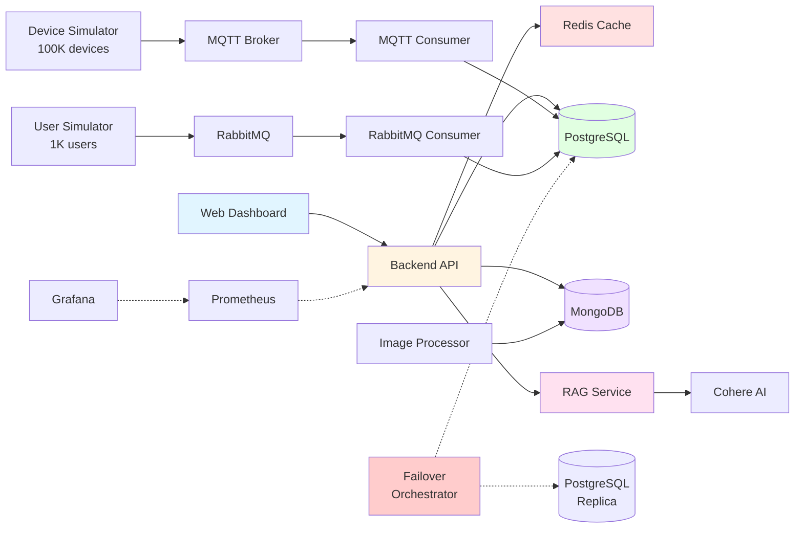

# Tier-0 Enterprise Reliability Engineering System

<div align="center">

**99.99999% Availability Target | Sub-5-Second Failover | 100K+ Devices**

[](https://www.docker.com/)
[](https://www.python.org/)
[](https://fastapi.tiangolo.com/)
[](https://www.postgresql.org/)
[](https://cohere.com/)

[📚 Documentation](docs/index.md) • [🏗️ Architecture](docs/architecture.md) • [🚀 Quick Start](#-quick-start) • [🎯 Features](#-key-features)

</div>

---

## 🎯 Overview

A production-grade demonstration of **Tier-0 Enterprise Site Reliability Engineering** principles, showcasing multi-region failover, AI-enhanced intelligence, and real-time data processing at Fortune 500 scale.

### What This System Demonstrates

<table>
<tr>
<td width="50%">

**🏢 Enterprise Scale**
- 100,000 IoT devices across 10 global sites
- Real-time telemetry via MQTT at 1000 msg/sec
- 1,000 concurrent user sessions
- Multi-region data replication

</td>
<td width="50%">

**🤖 AI Intelligence**
- Cohere-enhanced RAG for natural language queries
- Safety compliance detection from site cameras
- BP document analysis with semantic search
- Intelligent answer synthesis

</td>
</tr>
<tr>
<td>

**⚡ Tier-0 Reliability**
- 99.99999% SLA (3 seconds downtime/year)
- Sub-5-second multi-region failover
- PostgreSQL streaming replication
- Redis Sentinel automatic failover

</td>
<td>

**📊 Full Observability**
- Prometheus metrics collection
- Grafana visualization dashboards
- Real-time health monitoring
- Structured logging across services

</td>
</tr>
</table>

---

## 🚀 Quick Start

### Prerequisites
- Docker Desktop (8GB+ RAM recommended)
- Ports available: 3000, 8000-8003, 5432-5433, 6379-6380, 26379, 27017, 1883, 5672, 15672, 9090, 3001

### Installation

```bash
# 1. Clone repository
git clone <repository-url>
cd EntSystemsHackaton

# 2. Configure environment (optional - add Cohere API key)
cp .env.example .env
echo "COHERE_API_KEY=your_key_here" >> .env

# 3. Start all services (18+ containers)
docker-compose up --build

# 4. Wait for services to initialize (~3-5 minutes)
# Watch for: "✓ RAG service ready" in logs
```

### Access the System

| Service | URL | Purpose |
|---------|-----|---------|
| **🎛️ Dashboard** | http://localhost:3000 | Main application interface |
| **📡 Backend API** | http://localhost:8000 | REST API endpoints |
| **📖 API Docs** | http://localhost:8000/docs | Interactive Swagger UI |
| **🤖 RAG Service** | http://localhost:8001/health | AI query service status |
| **🔄 Failover** | http://localhost:8003/status | Multi-region failover control |

**Full service list**: See [Service Endpoints](docs/architecture.md#-network-architecture)

---

## 🎯 Demo Scenarios

Try these hands-on scenarios to explore the system:

### 1. Monitor IoT Fleet
```
1. Go to Device Telemetry tab
2. Select "WY-ALPHA" site
3. Filter by "turbine" type
4. Observe real-time metrics (RPM, temperature, power output)
```

### 2. Safety Compliance Check
```
1. Go to Camera Intelligence tab
2. Select device type (turbine, thermal engine, etc.)
3. Review safety compliance scores
4. Look for hard hat violations and PPE compliance
```

### 3. Log Forensics
```
1. Go to AI Query tab
2. Enter: "Which IP addresses are generating the most errors?"
3. Review IP addresses with errors
4. Analyze traffic patterns and error codes
```

### 4. BP Operations Query
```
1. Go to AI Query tab
2. Enter: "How many Tier 1 and Tier 2 safety incidents occurred in BP operations in 2024?"
3. Review AI-synthesized answer from BP Annual Reports
4. Examine source citations
```

### 5. Multi-Region Failover Test
```
1. Go to Failover tab (or visit http://localhost:8003)
2. Click "Failover to Region 2"
3. Observe sub-5-second failover completion
4. Verify database promotion and Redis Sentinel updates
```

---

## 🎯 Key Features

### 1. Multi-Region High Availability

<table>
<tr>
<td width="60%">

**Database Replication**
- PostgreSQL 16 streaming replication
- Hot standby replica ready for promotion
- Physical replication slots
- Sub-2-second promotion time

**Cache Failover**
- Redis master/replica architecture
- Redis Sentinel automatic monitoring
- Configurable failover policies
- Zero data loss with AOF persistence

**Orchestrated Failover**
- Automated health monitoring
- Database promotion coordination
- Write validation testing
- **Total failover time: 3-5 seconds**

</td>
<td width="40%">

**Test It Yourself**

```bash
# Via Dashboard
Click "Failover to Region 2"

# Via API
curl -X POST \
  http://localhost:8003/failover/region2
```

**Expected Result**:
```json
{
  "success": true,
  "total_failover_time": 3.4,
  "tier0_compliant": true,
  "steps": {
    "database_promotion": 1.2,
    "redis_failover": 0.8,
    "routing_update": 0.1,
    "validation": 1.3
  }
}
```

</td>
</tr>
</table>

📚 **Learn More**: [Multi-Region Failover Architecture](docs/failover.md)

---

### 2. AI-Enhanced RAG Query System

**Natural Language Queries** powered by Cohere with **vector-based semantic search**:

<table>
<tr>
<td width="33%">

**📄 BP Documents**
```
"How many safety incidents
occurred in BP operations
in 2024?"
```
→ FAISS vector search + Cohere synthesis for accurate answers

</td>
<td width="33%">

**📷 Site Images**
```
"Show me sites where
workers don't have
hard hats"
```
→ Queries MongoDB embeddings, analyzes compliance

</td>
<td width="33%">

**📊 System Logs**
```
"Which IP addresses are
generating the most errors?"
```
→ Aggregates PostgreSQL logs, provides insights

</td>
</tr>
</table>

**Architecture Highlights**:
- **Vector Search**: FAISS + Cohere `embed-english-v3.0` embeddings (1024D)
- **Semantic Retrieval**: Cosine similarity for intelligent matching
- **Hybrid RAG**: Combines vector search + pattern matching + keyword search
- **Top-K Retrieval**: Retrieves 5-10 most relevant chunks
- **Cohere Synthesis**: `command-a-vision-07-2025` for answer generation
- **Graceful Fallback**: Keyword-based responses (Tier-0 reliability)
- **Combined Multi-Source**: Queries across BP docs + images + logs

📚 **Learn More**: [RAG Pipeline Architecture](docs/data-pipelines.md#3-ai-enhanced-rag-query-pipeline)

---

### 3. 100K Device Simulation

**Scale**: 100,000 IoT devices distributed across 10 global sites

<table>
<tr>
<td>

**Device Types**
- 25K Gas Turbines
- 25K Thermal Engines
- 25K Electrical Rotors
- 25K Oil & Gas Devices

</td>
<td>

**Global Sites**
- WY-ALPHA (Wyoming)
- TX-EAGLE (Texas)
- ND-RAVEN (North Dakota)
- CA-DELTA (California)
- OK-BRAVO (Oklahoma)
- CO-SIERRA (Colorado)
- LA-GULF (Louisiana)
- NM-MESA (New Mexico)
- AK-NORTH (Alaska)
- MT-PEAK (Montana)

</td>
<td>

**Telemetry**
- MQTT topic: `og/field/{site}/{type}/{id}`
- 1000 devices/cycle
- 5-second intervals
- JSON payloads
- Real-time ingestion

</td>
</tr>
</table>

**Sample Telemetry**:
```json
{
  "device_id": "TURB-00912",
  "device_type": "turbine",
  "site_id": "WY-ALPHA",
  "timestamp_utc": "2025-11-16T12:30:45Z",
  "metrics": {
    "rpm": 3487,
    "inlet_temp_c": 412.6,
    "power_kw": 12850.4,
    "vibration_mm": 0.08
  },
  "status": {"state": "OK", "code": "TURB-OK"}
}
```

📚 **Learn More**: [Device Telemetry Pipeline](docs/data-pipelines.md#1-iot-device-telemetry-pipeline)

---

### 4. AI-Powered Safety Compliance

**Site Camera Intelligence** with Cohere embeddings and semantic search:

<table>
<tr>
<td width="50%">

**Detection Capabilities**
- ✅ Hard hat presence
- ✅ Safety vest detection
- ✅ Inspection equipment (tablets)
- ✅ PPE compliance scoring
- ✅ Site-level aggregation

</td>
<td width="50%">

**Query Examples**
```
"Show turbine sites with
workers without hard hats"

"What is the average safety
compliance score?"

"Get sites where engineers
have tablets and safety vests"
```

</td>
</tr>
</table>

**Processing Pipeline**:
1. Scan images from `assignment-materials/CMPE273HackathonData/`
2. Extract safety keywords (hard hat, vest, etc.)
3. Generate Cohere embeddings
4. Calculate compliance scores (0-100%)
5. Store in MongoDB with metadata

📚 **Learn More**: [Image Processing Pipeline](docs/data-pipelines.md#4-image-processing-pipeline)

---

## 🏗️ Architecture Overview



**18+ Microservices** orchestrated via Docker Compose with health checks and automatic restarts.

📚 **Full Architecture**: [System Architecture Documentation](docs/architecture.md)

---

## 📚 Documentation

<table>
<tr>
<td width="50%">

### Getting Started
- [📖 Documentation Hub](docs/index.md)
- [🚀 Deployment Guide](docs/deployment.md)
- [🎓 Assignment Overview](docs/assignment.md)

### Architecture
- [🏗️ System Architecture](docs/architecture.md)
- [📊 Data Pipelines](docs/data-pipelines.md)
- [🔄 Multi-Region Failover](docs/failover.md)

</td>
<td width="50%">

### Development
- [💻 Development Guide](docs/development.md)
- [📡 API Reference](docs/api-reference.md)
- [🧪 Testing Guide](docs/testing.md)

### Operations
- [📈 Monitoring & Observability](docs/monitoring.md)
- [🔧 Troubleshooting](docs/troubleshooting.md)
- [🔐 Security Hardening](docs/security.md)

</td>
</tr>
</table>

---

## 🛠️ Technology Stack

<table>
<tr>
<td width="25%">

**Infrastructure**
- Docker & Compose
- Nginx
- Prometheus
- Grafana

</td>
<td width="25%">

**Databases**
- PostgreSQL 16
- MongoDB 7
- Redis 7 (Sentinel)

</td>
<td width="25%">

**Message Brokers**
- MQTT (Mosquitto)
- RabbitMQ 3.12

</td>
<td width="25%">

**AI/ML**
- Cohere API (embeddings + LLM)
- FAISS (vector search)
- PyPDF (document parsing)
- scikit-learn
- NumPy

</td>
</tr>
</table>

---

## 🎓 Academic Context

**Course**: CMPE 273 - Enterprise Software Technologies
**University**: San José State University
**Objective**: Demonstrate Tier-0 SRE principles at Fortune 500 scale

### Learning Outcomes
1. High-Availability Architecture Design
2. Multi-Region Failover Implementation
3. Message-Driven Architecture (MQTT, RabbitMQ)
4. AI/ML Integration (RAG, Embeddings)
5. Microservices Orchestration
6. Real-Time Data Processing
7. Observability & Monitoring
8. Enterprise Security Patterns

📚 **Full Context**: [Assignment Overview](docs/assignment.md)

---

## 📊 Key Metrics

<table>
<tr>
<td align="center">

**99.99999%**
SLA Target

</td>
<td align="center">

**<5 seconds**
Failover Time

</td>
<td align="center">

**100,000**
IoT Devices

</td>
<td align="center">

**10**
Global Sites

</td>
</tr>
<tr>
<td align="center">

**18+**
Microservices

</td>
<td align="center">

**1,000**
Active Users

</td>
<td align="center">

**3**
Data Stores

</td>
<td align="center">

**2**
Message Brokers

</td>
</tr>
</table>

---

## 🧪 Quick Test Commands

```bash
# Check system health
curl http://localhost:8000/health

# Query device telemetry
curl http://localhost:8000/api/devices | jq

# Test RAG query
curl -X POST http://localhost:8001/query \
  -H "Content-Type: application/json" \
  -d '{"question": "How many safety incidents occurred in BP operations in 2024?"}'

# Test failover
curl -X POST http://localhost:8003/failover/region2

# View logs
docker-compose logs -f rag-service

# Subscribe to MQTT telemetry
mosquitto_sub -h localhost -p 1883 -t "og/field/#" -v
```

📚 **More Examples**: [Testing Guide](docs/testing.md)

---

## 🐛 Troubleshooting

<details>
<summary><b>Services not starting</b></summary>

```bash
# Check status
docker-compose ps

# View logs
docker-compose logs [service-name]

# Restart
docker-compose down -v
docker-compose up --build
```
</details>

<details>
<summary><b>No data in dashboard</b></summary>

```bash
# Verify simulators running
docker-compose ps | grep simulator

# Check MQTT messages
mosquitto_sub -h localhost -p 1883 -t "og/field/#" -v

# Verify database
docker exec -it tier0-postgres psql -U tier0user -d tier0_db -c \
  "SELECT COUNT(*) FROM device_telemetry;"
```
</details>

<details>
<summary><b>RAG/Cohere errors</b></summary>

```bash
# Check logs
docker-compose logs rag-service | grep -i cohere

# Verify API key
docker exec -it tier0-rag-service printenv COHERE_API_KEY

# Rebuild without cache
docker-compose build --no-cache rag-service
docker-compose up -d rag-service
```
</details>

📚 **Full Troubleshooting Guide**: [docs/troubleshooting.md](docs/troubleshooting.md)

---

## 🤝 Support

- 📖 [Documentation Hub](docs/index.md)
- 🔧 [Troubleshooting Guide](docs/troubleshooting.md)
- 💬 Check logs: `docker-compose logs [service-name]`
- 🔍 Verify health: `docker-compose ps`

---

## 📄 License

This is an academic project for educational purposes.

---

## 🎉 Acknowledgments

- **San José State University** - Enterprise Software Technologies Program
- **Cohere** - AI/ML capabilities
- **Open-source community** - Docker, PostgreSQL, Redis, FastAPI, and more
- **Fortune 500 SRE practices** - Architectural inspiration

---

<div align="center">

**Built with ❤️ for Enterprise Reliability Engineering Excellence**

**Target SLA: 99.99999% | Mission: Zero Downtime | Achieved: Sub-5-Second Failover**

[📚 Documentation](docs/index.md) • [🏗️ Architecture](docs/architecture.md) • [🚀 Deploy](docs/deployment.md) • [🔧 Troubleshoot](docs/troubleshooting.md)

</div>
