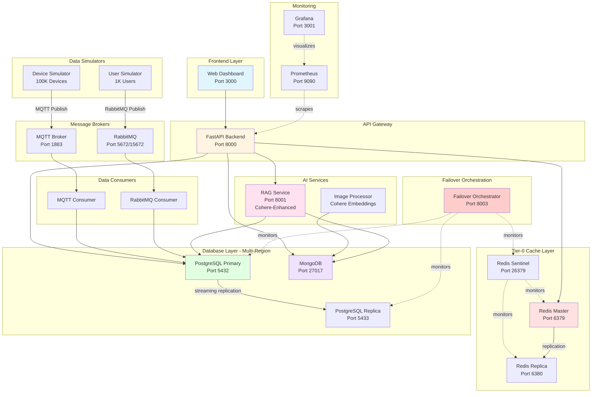

# System Architecture

## 🏗️ Overview

The Tier-0 Enterprise SRE System is designed as a microservices architecture targeting **99.99999% (seven-nines) availability**. The system demonstrates multi-region failover, AI-enhanced intelligence, and real-time data processing at scale.

---

## 📐 High-Level Architecture



---

## 🔧 Component Details

### Frontend Layer

#### Web Dashboard (Port 3000)
- **Technology**: Nginx + HTML5/CSS3/JavaScript
- **Purpose**: User interface for monitoring and queries
- **Features**:
  - Device telemetry visualization
  - User session monitoring
  - AI-powered natural language queries
  - Safety compliance dashboards
  - Multi-region failover controls

---

### API Gateway

#### Backend API (Port 8000)
- **Technology**: FastAPI + Uvicorn
- **Purpose**: Orchestration middleware for all services
- **Endpoints**:
  - `/health` - Health check
  - `/metrics` - Prometheus metrics
  - `/api/devices` - Device telemetry
  - `/api/users` - User sessions
  - `/api/images` - Image metadata
  - `/api/query` - RAG natural language queries
  - `/api/failover/*` - Failover orchestration

**Key Features**:
- Redis caching (60s TTL for device data)
- Connection pooling to all databases
- Prometheus metrics instrumentation
- CORS configuration for frontend

---

### Tier-0 Cache Layer

#### Redis Master (Port 6379)
- **Configuration**: 2GB max memory, LRU eviction
- **Purpose**: High-speed cache for device telemetry
- **Replication**: Streaming to Redis Replica
- **Persistence**: AOF (append-only file)

#### Redis Replica (Port 6380)
- **Configuration**: Hot standby, ready for promotion
- **Purpose**: Read replica + failover target
- **Monitored by**: Redis Sentinel

#### Redis Sentinel (Port 26379)
- **Purpose**: Automatic failover management
- **Configuration**:
  - Down-after-milliseconds: 5000
  - Failover-timeout: 10000
  - Quorum: 1 (single sentinel for demo)

---

### Database Layer

#### PostgreSQL Primary (Port 5432)
- **Version**: PostgreSQL 16
- **Configuration**:
  - WAL level: replica
  - Max WAL senders: 10
  - Replication slots: 10
- **Schemas**:
  - `device_telemetry` - IoT metrics
  - `user_sessions` - Active user tracking
  - `system_logs` - Apache-style access logs
  - `sites` - 10 global site definitions
  - `device_registry` - 100K device catalog

#### PostgreSQL Replica (Port 5433)
- **Purpose**: Hot standby for Region 2 failover
- **Replication**: Streaming via physical replication slot
- **Promotion**: Sub-2-second promotion to primary

#### MongoDB (Port 27017)
- **Version**: MongoDB 7
- **Database**: `tier0_images`
- **Collections**:
  - `images` - Image metadata + embeddings
  - `image_embeddings` - Cohere vector embeddings
- **Purpose**: NoSQL storage for unstructured data

---

### Message Brokers

#### MQTT Broker (Port 1883)
- **Technology**: Eclipse Mosquitto 2.0
- **Purpose**: IoT device telemetry ingestion
- **Topic Structure**: `og/field/{site_id}/{device_type}/{device_id}`
- **QoS**: 0 (at most once) for high throughput
- **Scale**: Handles 1000 devices/cycle

#### RabbitMQ (Port 5672/15672)
- **Version**: RabbitMQ 3.12 with management plugin
- **Purpose**: User activity event streaming
- **Queue**: `user_activity_queue`
- **Message Rate**: ~100 messages/second
- **Credentials**: tier0admin / tier0secure

---

### Data Simulators

#### Device Simulator
- **Scale**: 100,000 devices in memory
- **Active Publishing**: Random 1,000 devices per cycle
- **Device Types**:
  - Gas Turbines (25K)
  - Thermal Engines (25K)
  - Electrical Rotors (25K)
  - Oil & Gas Devices (25K)
- **Sites**: 10 global locations (10K devices each)
- **Interval**: 5 seconds (configurable)

#### User Simulator
- **Scale**: 1,000 active users
- **Events**: login, logout, idle, active
- **Distribution**: Across multiple regions
- **Interval**: 10 seconds (configurable)

---

### AI Services

#### RAG Service (Port 8001)
- **Technology**: FastAPI + Cohere API + FAISS Vector Search
- **Embedding Model**: `embed-english-v3.0` (1024 dimensions)
- **LLM Model**: `command-a-vision-07-2025`
- **Temperature**: 0.3 (factual responses)
- **Vector Search**:
  - FAISS IndexFlatIP with L2 normalization for cosine similarity
  - Semantic search using document embeddings
  - Overlapping chunks (1500 chars with 300 char overlap)
  - Top-K retrieval (configurable, default 5-10)
- **Hybrid RAG Architecture**:
  - Method 1: Vector semantic search (primary)
  - Method 2: Pattern-based search (for specific metrics)
  - Method 3: Keyword search (fallback)
  - Deduplication and relevance ranking
- **Capabilities**:
  - BP document analysis (PDFs) with semantic understanding
  - System log analysis (Apache logs)
  - Image safety compliance queries
  - Combined multi-source RAG
- **Fallback**: Keyword-based responses (Tier-0 reliability)
- **Token Management**: Adaptive snippet sizing (800-1500 chars based on content type)

#### Image Processor
- **Technology**: Python + Cohere Embeddings API
- **Purpose**: Process site camera images
- **Features**:
  - Safety compliance detection
  - Hard hat identification
  - PPE recognition
  - Semantic embedding generation
- **Output**: MongoDB with embeddings + compliance scores

---

### Data Consumers

#### MQTT Consumer
- **Purpose**: Ingest device telemetry → PostgreSQL
- **Subscription**: `og/field/#` (wildcard)
- **Processing**: Parse JSON → INSERT batch
- **Performance**: ~1000 inserts/second

#### RabbitMQ Consumer
- **Purpose**: Ingest user sessions → PostgreSQL
- **Queue**: `user_activity_queue`
- **Processing**: Upsert user session state
- **Acknowledgment**: Manual ack after DB commit

---

### Monitoring

#### Prometheus (Port 9090)
- **Purpose**: Metrics collection and alerting
- **Scrape Interval**: 15 seconds
- **Retention**: 30 days
- **Targets**:
  - Backend API (`/metrics`)
  - All containerized services

**Key Metrics**:
```
http_requests_total
http_request_duration_seconds
active_users
active_devices
system_uptime_seconds
```

#### Grafana (Port 3001)
- **Purpose**: Metrics visualization
- **Credentials**: admin / tier0admin
- **Data Source**: Prometheus
- **Dashboards**: Custom dashboards for SRE metrics

---

### Failover Orchestration

#### Failover Orchestrator (Port 8003)
- **Purpose**: Multi-region HA/DR coordination
- **Capabilities**:
  - PostgreSQL replica promotion
  - Redis Sentinel failover triggering
  - Health monitoring
  - Consistency validation
- **Target**: < 5 seconds total failover time
- **Endpoints**:
  - `/status` - Current region status
  - `/failover/{region}` - Initiate failover
  - `/health` - Orchestrator health

---

## 🔄 Service Communication Patterns

### Request-Response (Synchronous)
- Frontend ↔ Backend API (HTTP)
- Backend ↔ RAG Service (HTTP)
- Backend ↔ Databases (TCP)

### Publish-Subscribe (Asynchronous)
- Device Simulator → MQTT → MQTT Consumer
- User Simulator → RabbitMQ → RabbitMQ Consumer

### Pull-Based Monitoring
- Prometheus ← Backend API (metrics scraping)
- Grafana ← Prometheus (visualization)

---

## 🌐 Network Architecture

### Docker Network: `tier0-network`
- **Type**: Bridge network
- **Purpose**: Service discovery via DNS
- **Isolation**: All services communicate internally
- **Exposed Ports**: Only frontend, API, monitoring

### Port Mapping

| Internal Port | External Port | Service |
|---------------|---------------|---------|
| 80 | 3000 | Frontend |
| 8000 | 8000 | Backend API |
| 8001 | 8001 | RAG Service |
| 8003 | 8003 | Failover Orchestrator |
| 5432 | 5432 | PostgreSQL Primary |
| 5432 | 5433 | PostgreSQL Replica |
| 6379 | 6379 | Redis Master |
| 6379 | 6380 | Redis Replica |
| 26379 | 26379 | Redis Sentinel |
| 27017 | 27017 | MongoDB |
| 1883 | 1883 | MQTT |
| 5672 | 5672 | RabbitMQ |
| 15672 | 15672 | RabbitMQ Management |
| 9090 | 9090 | Prometheus |
| 3000 | 3001 | Grafana |

---

## 🔐 Security Architecture

### Current Implementation (Development)
- **No TLS/SSL**: Plain HTTP for all services
- **Default Credentials**: Hard-coded in docker-compose.yml
- **Open Ports**: All services exposed to localhost
- **No Authentication**: MQTT and APIs are open

### Production Recommendations
See [Security Hardening Guide](security.md) for production deployment checklist.

---

## 📊 Data Flow Architecture

For detailed data flow diagrams, see [Data Pipelines](data-pipelines.md):
- IoT Device Telemetry Pipeline
- User Session Pipeline
- AI-Enhanced RAG Query Pipeline
- Image Processing Pipeline
- Multi-Region Failover Architecture

---

## 🎯 Design Principles

### High Availability
- Multi-region database replication
- Redis Sentinel automatic failover
- Health checks on all services
- Graceful degradation (RAG fallbacks)

### Scalability
- Horizontal scaling ready (add more replicas)
- Message queues decouple producers/consumers
- Connection pooling for databases
- Redis caching reduces DB load

### Reliability (Tier-0)
- 99.99999% SLA target
- Sub-5-second failover
- Data consistency validation
- Automatic service restart on failure

### Observability
- Prometheus metrics on all services
- Structured logging
- Health check endpoints
- Grafana dashboards for visualization

---

## 🔧 Configuration Management

All configuration is externalized via:
- **Environment Variables**: Database credentials, API keys
- **Config Files**: `config/` directory for service-specific configs
- **Docker Compose**: Service orchestration and networking
- **Health Checks**: Automated readiness validation

---

## 📚 Related Documentation

- [Data Pipelines](data-pipelines.md) - Detailed flow diagrams
- [Deployment Guide](deployment.md) - Installation and setup
- [Development Guide](development.md) - Local development workflow
- [Monitoring Guide](monitoring.md) - Prometheus and Grafana setup

---

**Next**: Explore [Data Pipelines](data-pipelines.md) to understand how data flows through the system.
