# Data Pipelines

This document provides detailed flow diagrams for all major data pipelines in the Tier-0 Enterprise SRE System.

---

## 1. IoT Device Telemetry Pipeline


### Pipeline Components

**Device Simulator** (`simulators/device-simulator/simulator.py`)
- **Purpose**: Generate realistic IoT device telemetry
- **Scale**: 100,000 devices in memory
- **Publishing**: Random 1,000 devices per cycle
- **Interval**: 5 seconds (configurable via `PUBLISH_INTERVAL`)
- **Format**: JSON payloads matching device type schemas

**MQTT Broker** (Eclipse Mosquitto)
- **Port**: 1883
- **Protocol**: MQTT v3.1.1
- **QoS**: 0 (at most once) for throughput
- **Topic Structure**: `og/field/{site_id}/{device_type}/{device_id}`

**MQTT Consumer** (`services/mqtt-consumer/consumer.py`)
- **Subscription**: `og/field/#` (wildcard for all topics)
- **Processing**: Parse JSON, validate schema, batch insert
- **Error Handling**: Log parsing errors, continue processing
- **Performance**: ~1000 inserts/second

**PostgreSQL** (`device_telemetry` table)
```sql
CREATE TABLE device_telemetry (
    id SERIAL PRIMARY KEY,
    device_id VARCHAR(50) NOT NULL,
    device_type VARCHAR(50) NOT NULL,
    site_id VARCHAR(50) NOT NULL,
    timestamp_utc TIMESTAMP NOT NULL,
    metrics JSONB NOT NULL,
    status JSONB NOT NULL,
    created_at TIMESTAMP DEFAULT NOW()
);
CREATE INDEX idx_device_telemetry_device_id ON device_telemetry(device_id);
CREATE INDEX idx_device_telemetry_timestamp ON device_telemetry(timestamp_utc DESC);
```

**Redis Cache** (Tier-0 Layer)
- **Cache Key Pattern**: `devices:{site_id}:{device_type}` or `devices:all`
- **TTL**: 60 seconds
- **Strategy**: Cache-aside pattern
- **Eviction**: LRU (Least Recently Used)

### Topic Structure

| Component | Pattern | Example |
|-----------|---------|---------|
| Base | `og/field/` | `og/field/` |
| Site | `{site_id}` | `WY-ALPHA` |
| Device Type | `{device_type}` | `turbine` |
| Device ID | `{device_id}` | `TURB-00912` |
| **Full Topic** | `og/field/{site_id}/{device_type}/{device_id}` | `og/field/WY-ALPHA/turbine/TURB-00912` |

### Message Schema

**Turbine Example**:
```json
{
  "device_id": "TURB-00912",
  "device_type": "turbine",
  "site_id": "WY-ALPHA",
  "timestamp_utc": "2025-11-16T12:30:45Z",
  "metrics": {
    "rpm": 3487,
    "inlet_temp_c": 412.6,
    "outlet_temp_c": 389.2,
    "power_kw": 12850.4,
    "vibration_mm": 0.08
  },
  "status": {
    "state": "OK",
    "code": "TURB-OK"
  }
}
```

### Performance Characteristics

- **Throughput**: 1,000 messages/5 seconds = 200 msg/sec
- **Latency**: <50ms from publish to database
- **Cache Hit Rate**: ~80% (60s TTL)
- **Database Load**: Reduced by 80% with Redis cache

---

## 2. User Session Pipeline


### Pipeline Components

**User Simulator** (`simulators/user-simulator/simulator.py`)
- **Purpose**: Simulate enterprise user activity
- **Scale**: 1,000 active users
- **Events**: login, logout, idle, active
- **Interval**: 10 seconds (configurable via `PUBLISH_INTERVAL`)
- **Distribution**: Multiple regions (NA, EU, APAC)

**RabbitMQ** (Message Broker)
- **Port**: 5672 (AMQP), 15672 (Management UI)
- **Queue**: `user_activity_queue`
- **Exchange**: Default direct exchange
- **Durability**: Durable queue (survives broker restart)
- **Credentials**: tier0admin / tier0secure

**RabbitMQ Consumer** (`services/rabbitmq-consumer/consumer.py`)
- **Queue**: `user_activity_queue`
- **Prefetch**: 10 messages
- **Acknowledgment**: Manual ack after DB commit
- **Error Handling**: Dead letter queue for failed messages

**PostgreSQL** (`user_sessions` table)
```sql
CREATE TABLE user_sessions (
    id SERIAL PRIMARY KEY,
    user_id VARCHAR(50) NOT NULL,
    session_id UUID NOT NULL,
    connection_status VARCHAR(20) NOT NULL,
    region VARCHAR(50),
    login_time TIMESTAMP,
    logout_time TIMESTAMP,
    last_activity TIMESTAMP DEFAULT NOW()
);
CREATE INDEX idx_user_sessions_user_id ON user_sessions(user_id);
CREATE INDEX idx_user_sessions_status ON user_sessions(connection_status);
```

### Message Schema

```json
{
  "user_id": "user_0042",
  "session_id": "550e8400-e29b-41d4-a716-446655440000",
  "event": "active",
  "connection_status": "active",
  "region": "NA-WEST",
  "timestamp": "2025-11-16T12:30:45Z"
}
```

### Session States

| State | Description | Transition |
|-------|-------------|------------|
| **active** | User actively using system | login → active, idle → active |
| **idle** | User inactive for >5 minutes | active → idle |
| **disconnected** | User logged out | active/idle → disconnected |

### Performance Characteristics

- **Message Rate**: ~100 messages/second
- **Queue Depth**: <100 messages (low latency)
- **Processing Time**: <10ms per message
- **Database Operations**: Upsert based on session_id

---

## 3. AI-Enhanced RAG Query Pipeline


### Pipeline Components

**RAG Service** (`services/rag-service/rag_server.py`)
- **Port**: 8001
- **Framework**: FastAPI
- **AI Routing**:
  - **Primary**: OpenAI `gpt-4o` function calling (~95% accuracy)
  - **Fallback**: Cohere `command-a-vision-07-2025` tool use (~90% accuracy)
  - **Tier-0**: Keyword-based routing (~70-80% accuracy, no API)
- **Embedding Models**:
  - **Primary**: OpenAI `text-embedding-3-large` (3072 dimensions)
  - **Fallback**: Cohere `embed-english-v3.0` (1024 dimensions)
- **LLM Models**:
  - **Primary**: OpenAI `gpt-4o` for synthesis
  - **Fallback**: Cohere `command-a-vision-07-2025` for synthesis
- **Temperature**: 0.1 (routing), 0.3 (synthesis)
- **Max Tokens**: 300-600 depending on query complexity

**Query Routing** (AI-Driven):
```python
# Phase 1: AI function calling / tool use (OpenAI primary, Cohere fallback)
tools = [
    {"name": "search_images", "description": "Search site cameras for safety compliance..."},
    {"name": "search_documents", "description": "Search BP Annual Reports via FAISS..."},
    {"name": "search_logs", "description": "Search PostgreSQL system logs..."}
]

# OpenAI gpt-4o with function calling (preferred)
if openai_client:
    response = openai_client.chat.completions.create(
        model="gpt-4o",
        messages=[...],
        tools=tools,
        tool_choice="auto"
    )
    # AI returns: tool_calls = [{"function": {"name": "search_documents", ...}}]

# Cohere command-a-vision with tool use (fallback)
elif cohere_client:
    response = cohere_client.chat(
        message=question,
        model="command-a-vision-07-2025",
        tools=tools
    )
    # Cohere returns: tool_calls = [ToolCall(name="search_documents", ...)]

# Phase 2: Keyword fallback (Tier-0 reliability, no API)
else:
    # Rule-based routing by keyword matching
    if "incident" in question or "safety" in question:
        route_to = ["search_documents", "search_images"]
    elif "image" in question or "camera" in question:
        route_to = ["search_images"]
    # ... etc
```

**BP Document Processing** (Hybrid RAG):
1. **Load PDFs**: Parse BP Annual Reports from `/app/bp_docs`
2. **Vector Search** (Primary):
   - Create overlapping chunks (1500 chars, 300 overlap)
   - Generate embeddings (OpenAI `text-embedding-3-large` or Cohere `embed-english-v3.0`)
   - Build FAISS index with cosine similarity
   - Query: Generate embedding → FAISS search → Top-K retrieval
3. **Pattern Matching** (Secondary):
   - Regex patterns for specific metrics: `(\d+)\s+Tier\s+[12].*?events`
   - Extract context window (1000 chars before/after)
   - High relevance scoring for pattern matches
4. **Keyword Search** (Fallback):
   - Search for safety keywords when vector unavailable
   - Relevance scoring: +1 per keyword, +5 for numbers, +3 for metrics
5. **Deduplication**: Remove duplicate chunks by text similarity
6. **AI Synthesis**:
   - OpenAI `gpt-4o` (preferred) or Cohere `command-a-vision` (fallback)
   - Top 5 snippets → LLM → synthesized answer with citations
7. **Tier-0 Fallback**: If AI unavailable, return keyword-based excerpts

**Image Query Processing**:
1. **Query MongoDB**: Filter by `safety_compliance` fields
2. **Aggregate Statistics**: Calculate avg compliance, site breakdown
3. **AI Synthesis**:
   - OpenAI `gpt-4o` (preferred) or Cohere `command-a-vision` (fallback)
   - Send context to LLM for intelligent summary
4. **Tier-0 Fallback**: Return raw statistics if AI unavailable

**Log Query Processing**:
1. **Aggregate PostgreSQL**: Run SQL aggregations on `system_logs`
2. **Extract Stats**: Top IPs, error counts, response times
3. **AI Synthesis**:
   - OpenAI `gpt-4o` (preferred) or Cohere `command-a-vision` (fallback)
   - Generate insights from statistics
4. **Tier-0 Fallback**: Return raw stats if AI unavailable

### Query Examples

**BP Document Query**:
```bash
curl -X POST http://localhost:8001/query \
  -H "Content-Type: application/json" \
  -d '{"question": "How many safety incidents occurred in BP operations in 2024?"}'
```

**Response**:
```json
{
  "answer": "BP reported 38 Tier 1 and Tier 2 process safety events in 2024, a decrease from 39 in 2023...",
  "sources": [...],
  "type": "bp_documents",
  "routing_method": "ai_function_calling",
  "tools_called": ["search_documents"],
  "synthesized": true
}
```

**Image Query**:
```bash
curl -X POST http://localhost:8001/query \
  -H "Content-Type: application/json" \
  -d '{"question": "Show me sites where workers don'\''t have hard hats"}'
```

**Response**:
```json
{
  "answer": "Analysis reveals 12 images from 4 sites showing workers without proper hard hat PPE. Thermal engine sites show 56.7% compliance...",
  "data": [...],
  "sites": ["thermal_engine", "turbine", "electrical_rotor"],
  "avg_compliance": 56.7,
  "type": "image_analysis",
  "routing_method": "ai_function_calling",
  "tools_called": ["search_images"],
  "synthesized": true
}
```

### AI Integration Details

**Three-Tier AI Provider Strategy**:

**Tier 1 - OpenAI (Primary)**:
```python
# Routing with function calling
response = openai_client.chat.completions.create(
    model="gpt-4o",
    messages=[...],
    tools=[...],
    tool_choice="auto",
    temperature=0.1  # Low for deterministic routing
)

# Embeddings for vector search
embedding = openai_client.embeddings.create(
    model="text-embedding-3-large",  # 3072 dimensions
    input=text
)

# Answer synthesis
synthesis = openai_client.chat.completions.create(
    model="gpt-4o",
    messages=[...],
    temperature=0.3,  # Slightly higher for natural language
    max_tokens=500
)
```

**Tier 2 - Cohere (Fallback)**:
```python
# Routing with tool use
response = cohere_client.chat(
    message=question,
    model="command-a-vision-07-2025",
    tools=[...],
    temperature=0.1
)

# Embeddings for vector search (with rate limiting)
embedding = cohere_client.embed(
    texts=[text],
    model="embed-english-v3.0",  # 1024 dimensions
    input_type="search_document"
)
time.sleep(0.7)  # Rate limit: ~85 calls/min for trial keys

# Answer synthesis
synthesis = cohere_client.chat(
    message=prompt,
    model="command-a-vision-07-2025",
    temperature=0.3,
    max_tokens=500
)
```

**Tier 3 - Keyword Routing (Tier-0 Reliability)**:
```python
# Rule-based routing when AI unavailable
question_lower = question.lower()

if any(kw in question_lower for kw in ["incident", "safety"]):
    return query_bp_documents(question) + query_images(question)
elif any(kw in question_lower for kw in ["image", "camera"]):
    return query_images(question)
elif any(kw in question_lower for kw in ["log", "ip", "error"]):
    return query_logs(question)
# ... etc
```

**Token Management**:
- BP snippets: 800-1500 chars each (adaptive based on content type)
- Max 5 snippets per query = ~4,000-7,500 chars total
- OpenAI: 128K context window (well within limits)
- Cohere: 128K context window (well within limits)

**Reliability Strategy** (Tier-0 Compliance):
```python
# Phase 1: Try OpenAI
try:
    result = route_with_openai(question)
    if result:
        return result
except Exception as e:
    logger.warning(f"OpenAI failed: {e}")

# Phase 2: Try Cohere fallback
try:
    result = route_with_cohere(question)
    if result:
        return result
except Exception as e:
    logger.warning(f"Cohere failed: {e}")

# Phase 3: Keyword-based routing (no API dependency)
logger.info("Using keyword routing (Tier-0 fallback)")
return route_with_keywords(question)
```

---

## 4. Image Processing Pipeline


### Pipeline Components

**Image Processor** (`services/image-processor/processor.py`)
- **Purpose**: Process site camera images with AI
- **Input**: `/app/images` (mounted from `assignment-materials/CMPE273HackathonData/`)
- **Output**: MongoDB `tier0_images.images` collection
- **Processing**: One-time on startup + periodic scans
- **AI Provider**: Uses same tiered strategy (OpenAI primary, Cohere fallback)

**Image Categories**:
```
/app/images/
├── TurbineImages/        # Gas turbine sites
├── ThermalEngines/       # Thermal power plants
├── ElectricalRotors/     # Electrical equipment
└── OilAndGas/           # Oil & gas operations
```

**Safety Compliance Detection**:
```python
keywords = {
    "hard hat": ["hard hat", "helmet", "safety hat"],
    "safety vest": ["safety vest", "hi-vis", "reflective vest"],
    "inspection equipment": ["tablet", "ipad", "device", "handheld"]
}

compliance_score = (
    has_hard_hat * 40 +      # 40% weight
    has_safety_vest * 30 +    # 30% weight
    has_equipment * 30        # 30% weight
)
```

**Embedding Generation**:
- **Primary**: OpenAI `text-embedding-3-large` (3072 dimensions)
- **Fallback**: Cohere `embed-english-v3.0` (1024 dimensions)
- **Input**: Image description + keywords
- **Purpose**: Semantic search across images

**MongoDB Schema**:
```json
{
  "_id": ObjectId("..."),
  "filename": "IMG_20240615_143052.jpg",
  "device_type": "turbine",
  "site_id": "WY-ALPHA",
  "description": "Worker inspecting turbine with safety equipment",
  "keywords": ["hard hat", "safety vest", "outdoor", "inspection"],
  "safety_compliance": {
    "has_hard_hat": true,
    "has_safety_vest": true,
    "has_inspection_equipment": true,
    "compliance_score": 100
  },
  "embedding": [0.123, -0.456, ...],  // 3072-dim (OpenAI) or 1024-dim (Cohere)
  "processed": true,
  "processed_at": ISODate("2025-11-16T12:30:00Z")
}
```

### Performance Characteristics

- **Processing Rate**: ~5-10 images/second
- **OpenAI API Latency**: ~100-200ms per embedding (no rate limit on paid tier)
- **Cohere API Latency**: ~200-500ms per embedding (rate limited on trial: 0.7s sleep between calls)
- **Initial Processing**: ~10-15 minutes for all images (OpenAI) or ~30-45 minutes (Cohere trial)
- **Incremental Updates**: Process new images only

---

## 5. Multi-Region Failover Architecture

```mermaid
sequenceDiagram
    participant ORCH as Failover Orchestrator
    participant PG_P as PostgreSQL Primary<br/>(Region 1)
    participant PG_R as PostgreSQL Replica<br/>(Region 2)
    participant SENT as Redis Sentinel
    participant REDIS_M as Redis Master
    participant REDIS_R as Redis Replica
    participant API as Backend API

    Note over ORCH: Initiate failover to Region 2

    ORCH->>PG_R: Check health & replication lag
    PG_R-->>ORCH: Healthy, lag: 0.2s

    Note over ORCH: Step 1: Promote Replica
    ORCH->>PG_R: Promote to primary<br/>(pg_ctl promote)
    PG_R-->>ORCH: Promotion complete (1.2s)

    Note over ORCH: Step 2: Redis Failover
    ORCH->>SENT: Trigger sentinel failover
    SENT->>REDIS_R: Promote to master
    SENT->>REDIS_M: Demote to replica
    SENT-->>ORCH: Failover complete (0.8s)

    Note over ORCH: Step 3: Update Routing
    ORCH->>ORCH: Update CURRENT_REGION=region2

    Note over ORCH: Step 4: Validate Consistency
    ORCH->>PG_R: Verify write capability
    PG_R-->>ORCH: Write successful

    ORCH->>API: Health check via new primary
    API-->>ORCH: System healthy

    Note over ORCH: Total failover time: 3.4s<br/>✓ Tier-0 compliant (<5s)
```



### Pipeline Components

**Failover Orchestrator** (`services/failover-orchestrator/orchestrator.py`)
- **Port**: 8003
- **Purpose**: Coordinate multi-region failover
- **Target**: <5 seconds total downtime
- **Validation**: Write test + health checks

**PostgreSQL Replication**:
- **Method**: Streaming replication
- **Type**: Physical (WAL-based)
- **Replication Slot**: `replication_slot`
- **Lag Monitoring**: <1 second typical

**Redis Sentinel**:
- **Quorum**: 1 (demo configuration)
- **Down-after**: 5000ms
- **Failover Timeout**: 10000ms
- **Parallel Syncs**: 1

**Failover Steps**:
1. **Health Check** (0.2s): Verify replica is healthy and in sync
2. **Database Promotion** (1.2s): `pg_ctl promote` on replica
3. **Redis Failover** (0.8s): Sentinel promotes replica to master
4. **Routing Update** (0.1s): Update CURRENT_REGION variable
5. **Write Validation** (1.1s): Execute test write, verify success

**Total Time**: 3.4 seconds (Tier-0 compliant)

### Testing Failover

```bash
# Trigger failover to Region 2
curl -X POST http://localhost:8003/failover/region2

# Monitor failover progress
curl http://localhost:8003/status

# Expected response
{
  "current_region": "region2",
  "last_failover": {
    "target_region": "region2",
    "total_time": 3.4,
    "tier0_compliant": true,
    "timestamp": "2025-11-16T12:30:00Z"
  }
}
```

---

## 📊 Pipeline Performance Summary

| Pipeline | Throughput | Latency | Database | Cache |
|----------|------------|---------|----------|-------|
| **Device Telemetry** | 200 msg/sec | <50ms | PostgreSQL | Redis (60s TTL) |
| **User Sessions** | 100 msg/sec | <10ms | PostgreSQL | None |
| **RAG Queries** | 10 queries/sec | 500-2000ms | PostgreSQL + MongoDB + FAISS | None |
| **Image Processing** | 5-10 images/sec | 200-500ms | MongoDB | None |
| **Failover** | On-demand | 3-5 seconds | PostgreSQL + Redis | N/A |

---

## 🔗 Related Documentation

- [RAG Service Architecture](rag-architecture.md) - Detailed AI agent pattern explanation
- [System Architecture](architecture.md) - Component details
- [Development Guide](development.md) - Testing pipelines locally
- [Testing Guide](testing.md) - Pipeline validation procedures
- [Monitoring Guide](monitoring.md) - Pipeline metrics and alerts

---

**Next**: Explore [Failover Architecture](failover.md) for detailed multi-region HA/DR design.
