# Data Pipelines

This document provides detailed flow diagrams for all major data pipelines in the Tier-0 Enterprise SRE System.

---

## 1. IoT Device Telemetry Pipeline


### Pipeline Components

**Device Simulator** (`simulators/device-simulator/simulator.py`)
- **Purpose**: Generate realistic IoT device telemetry
- **Scale**: 100,000 devices in memory
- **Publishing**: Random 1,000 devices per cycle
- **Interval**: 5 seconds (configurable via `PUBLISH_INTERVAL`)
- **Format**: JSON payloads matching device type schemas

**MQTT Broker** (Eclipse Mosquitto)
- **Port**: 1883
- **Protocol**: MQTT v3.1.1
- **QoS**: 0 (at most once) for throughput
- **Topic Structure**: `og/field/{site_id}/{device_type}/{device_id}`

**MQTT Consumer** (`services/mqtt-consumer/consumer.py`)
- **Subscription**: `og/field/#` (wildcard for all topics)
- **Processing**: Parse JSON, validate schema, batch insert
- **Error Handling**: Log parsing errors, continue processing
- **Performance**: ~1000 inserts/second

**PostgreSQL** (`device_telemetry` table)
```sql
CREATE TABLE device_telemetry (
    id SERIAL PRIMARY KEY,
    device_id VARCHAR(50) NOT NULL,
    device_type VARCHAR(50) NOT NULL,
    site_id VARCHAR(50) NOT NULL,
    timestamp_utc TIMESTAMP NOT NULL,
    metrics JSONB NOT NULL,
    status JSONB NOT NULL,
    created_at TIMESTAMP DEFAULT NOW()
);
CREATE INDEX idx_device_telemetry_device_id ON device_telemetry(device_id);
CREATE INDEX idx_device_telemetry_timestamp ON device_telemetry(timestamp_utc DESC);
```

**Redis Cache** (Tier-0 Layer)
- **Cache Key Pattern**: `devices:{site_id}:{device_type}` or `devices:all`
- **TTL**: 60 seconds
- **Strategy**: Cache-aside pattern
- **Eviction**: LRU (Least Recently Used)

### Topic Structure

| Component | Pattern | Example |
|-----------|---------|---------|
| Base | `og/field/` | `og/field/` |
| Site | `{site_id}` | `WY-ALPHA` |
| Device Type | `{device_type}` | `turbine` |
| Device ID | `{device_id}` | `TURB-00912` |
| **Full Topic** | `og/field/{site_id}/{device_type}/{device_id}` | `og/field/WY-ALPHA/turbine/TURB-00912` |

### Message Schema

**Turbine Example**:
```json
{
  "device_id": "TURB-00912",
  "device_type": "turbine",
  "site_id": "WY-ALPHA",
  "timestamp_utc": "2025-11-16T12:30:45Z",
  "metrics": {
    "rpm": 3487,
    "inlet_temp_c": 412.6,
    "outlet_temp_c": 389.2,
    "power_kw": 12850.4,
    "vibration_mm": 0.08
  },
  "status": {
    "state": "OK",
    "code": "TURB-OK"
  }
}
```

### Performance Characteristics

- **Throughput**: 1,000 messages/5 seconds = 200 msg/sec
- **Latency**: <50ms from publish to database
- **Cache Hit Rate**: ~80% (60s TTL)
- **Database Load**: Reduced by 80% with Redis cache

---

## 2. User Session Pipeline


### Pipeline Components

**User Simulator** (`simulators/user-simulator/simulator.py`)
- **Purpose**: Simulate enterprise user activity
- **Scale**: 1,000 active users
- **Events**: login, logout, idle, active
- **Interval**: 10 seconds (configurable via `PUBLISH_INTERVAL`)
- **Distribution**: Multiple regions (NA, EU, APAC)

**RabbitMQ** (Message Broker)
- **Port**: 5672 (AMQP), 15672 (Management UI)
- **Queue**: `user_activity_queue`
- **Exchange**: Default direct exchange
- **Durability**: Durable queue (survives broker restart)
- **Credentials**: tier0admin / tier0secure

**RabbitMQ Consumer** (`services/rabbitmq-consumer/consumer.py`)
- **Queue**: `user_activity_queue`
- **Prefetch**: 10 messages
- **Acknowledgment**: Manual ack after DB commit
- **Error Handling**: Dead letter queue for failed messages

**PostgreSQL** (`user_sessions` table)
```sql
CREATE TABLE user_sessions (
    id SERIAL PRIMARY KEY,
    user_id VARCHAR(50) NOT NULL,
    session_id UUID NOT NULL,
    connection_status VARCHAR(20) NOT NULL,
    region VARCHAR(50),
    login_time TIMESTAMP,
    logout_time TIMESTAMP,
    last_activity TIMESTAMP DEFAULT NOW()
);
CREATE INDEX idx_user_sessions_user_id ON user_sessions(user_id);
CREATE INDEX idx_user_sessions_status ON user_sessions(connection_status);
```

### Message Schema

```json
{
  "user_id": "user_0042",
  "session_id": "550e8400-e29b-41d4-a716-446655440000",
  "event": "active",
  "connection_status": "active",
  "region": "NA-WEST",
  "timestamp": "2025-11-16T12:30:45Z"
}
```

### Session States

| State | Description | Transition |
|-------|-------------|------------|
| **active** | User actively using system | login → active, idle → active |
| **idle** | User inactive for >5 minutes | active → idle |
| **disconnected** | User logged out | active/idle → disconnected |

### Performance Characteristics

- **Message Rate**: ~100 messages/second
- **Queue Depth**: <100 messages (low latency)
- **Processing Time**: <10ms per message
- **Database Operations**: Upsert based on session_id

---

## 3. AI-Enhanced RAG Query Pipeline


### Pipeline Components

**RAG Service** (`services/rag-service/rag_server.py`)
- **Port**: 8001
- **Framework**: FastAPI
- **Cohere Model**: `command-a-vision-07-2025`
- **Temperature**: 0.3 (factual responses)
- **Max Tokens**: 300-500 depending on query type

**Query Classification**:
```python
# Safety queries (combined BP + images)
keywords = ["incident", "safety", "hard hat", "helmet", "vest", "equipment", "compliance"]

# Image queries
keywords = ["image", "camera", "site", "worker", "engineer", "tablet"]

# Log queries
keywords = ["log", "ip", "error", "request"]

# BP document queries
keywords = ["bp", "drill", "operation", "annual report"]
```

**BP Document Processing**:
1. **Load PDFs**: Parse BP Annual Reports from `/app/bp_docs`
2. **Keyword Search**: Find paragraphs matching safety keywords
3. **Relevance Scoring**:
   - Base score: +1 per keyword match
   - Numerical boost: +5 if contains data (2024, 38, 96, etc.)
   - Metric boost: +3 for specific terms (tier 1, tier 2, process safety)
4. **Snippet Truncation**: Max 800 chars per snippet (prevent token overflow)
5. **Cohere Synthesis**: Top 5 snippets → chat API → synthesized answer
6. **Fallback**: If Cohere fails, return keyword-based excerpts

**Image Query Processing**:
1. **Query MongoDB**: Filter by `safety_compliance` fields
2. **Aggregate Statistics**: Calculate avg compliance, site breakdown
3. **Cohere Synthesis**: Send context to chat API for intelligent summary
4. **Fallback**: Return raw statistics if Cohere fails

**Log Query Processing**:
1. **Aggregate PostgreSQL**: Run SQL aggregations on `system_logs`
2. **Extract Stats**: Top IPs, error counts, response times
3. **Cohere Synthesis**: Generate insights from statistics
4. **Fallback**: Return raw stats if Cohere fails

### Query Examples

**BP Document Query**:
```bash
curl -X POST http://localhost:8001/query \
  -H "Content-Type: application/json" \
  -d '{"question": "How many safety incidents occurred in BP operations in 2024?"}'
```

**Response**:
```json
{
  "answer": "BP reported 38 Tier 1 and Tier 2 process safety events in 2024, a decrease from 39 in 2023. This includes 96 oil spills totaling 1,425 barrels...",
  "sources": [...],
  "type": "bp_documents",
  "synthesized": true
}
```

**Image Query**:
```bash
curl -X POST http://localhost:8001/query \
  -H "Content-Type: application/json" \
  -d '{"question": "Show me sites where workers don'\''t have hard hats"}'
```

**Response**:
```json
{
  "answer": "Analysis reveals 12 images from 4 sites showing workers without proper hard hat PPE. Thermal engine sites show 56.7% compliance...",
  "data": [...],
  "sites": ["thermal_engine", "turbine", "electrical_rotor"],
  "avg_compliance": 56.7,
  "type": "image_analysis",
  "synthesized": true
}
```

### Cohere Integration Details

**Configuration**:
```python
response = self.cohere_client.chat(
    message=prompt,
    model="command-a-vision-07-2025",
    temperature=0.3,  # Factual, not creative
    max_tokens=500    # BP docs: 500, images/logs: 300
)
```

**Token Management**:
- BP snippets truncated to 800 chars each
- Max 5 snippets = ~4,000 chars total
- Well within 128K token limit

**Fallback Strategy** (Tier-0 Reliability):
```python
try:
    response = cohere_client.chat(...)
except Exception as e:
    logger.warning(f"Cohere failed, falling back: {e}")
    # Return keyword-based response
```

---

## 4. Image Processing Pipeline


### Pipeline Components

**Image Processor** (`services/image-processor/processor.py`)
- **Purpose**: Process site camera images with AI
- **Input**: `/app/images` (mounted from `assignment-materials/CMPE273HackathonData/`)
- **Output**: MongoDB `tier0_images.images` collection
- **Processing**: One-time on startup + periodic scans

**Image Categories**:
```
/app/images/
├── TurbineImages/        # Gas turbine sites
├── ThermalEngines/       # Thermal power plants
├── ElectricalRotors/     # Electrical equipment
└── OilAndGas/           # Oil & gas operations
```

**Safety Compliance Detection**:
```python
keywords = {
    "hard hat": ["hard hat", "helmet", "safety hat"],
    "safety vest": ["safety vest", "hi-vis", "reflective vest"],
    "inspection equipment": ["tablet", "ipad", "device", "handheld"]
}

compliance_score = (
    has_hard_hat * 40 +      # 40% weight
    has_safety_vest * 30 +    # 30% weight
    has_equipment * 30        # 30% weight
)
```

**Cohere Embeddings**:
- **Model**: Embed endpoint (not chat)
- **Input**: Image description + keywords
- **Output**: 1024-dimensional vector
- **Purpose**: Semantic search across images

**MongoDB Schema**:
```json
{
  "_id": ObjectId("..."),
  "filename": "IMG_20240615_143052.jpg",
  "device_type": "turbine",
  "site_id": "WY-ALPHA",
  "description": "Worker inspecting turbine with safety equipment",
  "keywords": ["hard hat", "safety vest", "outdoor", "inspection"],
  "safety_compliance": {
    "has_hard_hat": true,
    "has_safety_vest": true,
    "has_inspection_equipment": true,
    "compliance_score": 100
  },
  "embedding": [0.123, -0.456, ...],  // 1024-dim vector
  "processed": true,
  "processed_at": ISODate("2025-11-16T12:30:00Z")
}
```

### Performance Characteristics

- **Processing Rate**: ~5-10 images/second
- **Cohere API Latency**: ~200-500ms per embedding
- **Initial Processing**: ~10-15 minutes for all images
- **Incremental Updates**: Process new images only

---

## 5. Multi-Region Failover Architecture

```mermaid
sequenceDiagram
    participant ORCH as Failover Orchestrator
    participant PG_P as PostgreSQL Primary<br/>(Region 1)
    participant PG_R as PostgreSQL Replica<br/>(Region 2)
    participant SENT as Redis Sentinel
    participant REDIS_M as Redis Master
    participant REDIS_R as Redis Replica
    participant API as Backend API

    Note over ORCH: Initiate failover to Region 2

    ORCH->>PG_R: Check health & replication lag
    PG_R-->>ORCH: Healthy, lag: 0.2s

    Note over ORCH: Step 1: Promote Replica
    ORCH->>PG_R: Promote to primary<br/>(pg_ctl promote)
    PG_R-->>ORCH: Promotion complete (1.2s)

    Note over ORCH: Step 2: Redis Failover
    ORCH->>SENT: Trigger sentinel failover
    SENT->>REDIS_R: Promote to master
    SENT->>REDIS_M: Demote to replica
    SENT-->>ORCH: Failover complete (0.8s)

    Note over ORCH: Step 3: Update Routing
    ORCH->>ORCH: Update CURRENT_REGION=region2

    Note over ORCH: Step 4: Validate Consistency
    ORCH->>PG_R: Verify write capability
    PG_R-->>ORCH: Write successful

    ORCH->>API: Health check via new primary
    API-->>ORCH: System healthy

    Note over ORCH: Total failover time: 3.4s<br/>✓ Tier-0 compliant (<5s)
```



### Pipeline Components

**Failover Orchestrator** (`services/failover-orchestrator/orchestrator.py`)
- **Port**: 8003
- **Purpose**: Coordinate multi-region failover
- **Target**: <5 seconds total downtime
- **Validation**: Write test + health checks

**PostgreSQL Replication**:
- **Method**: Streaming replication
- **Type**: Physical (WAL-based)
- **Replication Slot**: `replication_slot`
- **Lag Monitoring**: <1 second typical

**Redis Sentinel**:
- **Quorum**: 1 (demo configuration)
- **Down-after**: 5000ms
- **Failover Timeout**: 10000ms
- **Parallel Syncs**: 1

**Failover Steps**:
1. **Health Check** (0.2s): Verify replica is healthy and in sync
2. **Database Promotion** (1.2s): `pg_ctl promote` on replica
3. **Redis Failover** (0.8s): Sentinel promotes replica to master
4. **Routing Update** (0.1s): Update CURRENT_REGION variable
5. **Write Validation** (1.1s): Execute test write, verify success

**Total Time**: 3.4 seconds (Tier-0 compliant)

### Testing Failover

```bash
# Trigger failover to Region 2
curl -X POST http://localhost:8003/failover/region2

# Monitor failover progress
curl http://localhost:8003/status

# Expected response
{
  "current_region": "region2",
  "last_failover": {
    "target_region": "region2",
    "total_time": 3.4,
    "tier0_compliant": true,
    "timestamp": "2025-11-16T12:30:00Z"
  }
}
```

---

## 📊 Pipeline Performance Summary

| Pipeline | Throughput | Latency | Database | Cache |
|----------|------------|---------|----------|-------|
| **Device Telemetry** | 200 msg/sec | <50ms | PostgreSQL | Redis (60s TTL) |
| **User Sessions** | 100 msg/sec | <10ms | PostgreSQL | None |
| **RAG Queries** | 10 queries/sec | 500-2000ms | PostgreSQL + MongoDB | None |
| **Image Processing** | 5-10 images/sec | 200-500ms | MongoDB | None |
| **Failover** | On-demand | 3-5 seconds | PostgreSQL + Redis | N/A |

---

## 🔗 Related Documentation

- [System Architecture](architecture.md) - Component details
- [Development Guide](development.md) - Testing pipelines locally
- [Testing Guide](testing.md) - Pipeline validation procedures
- [Monitoring Guide](monitoring.md) - Pipeline metrics and alerts

---

**Next**: Explore [Failover Architecture](failover.md) for detailed multi-region HA/DR design.
