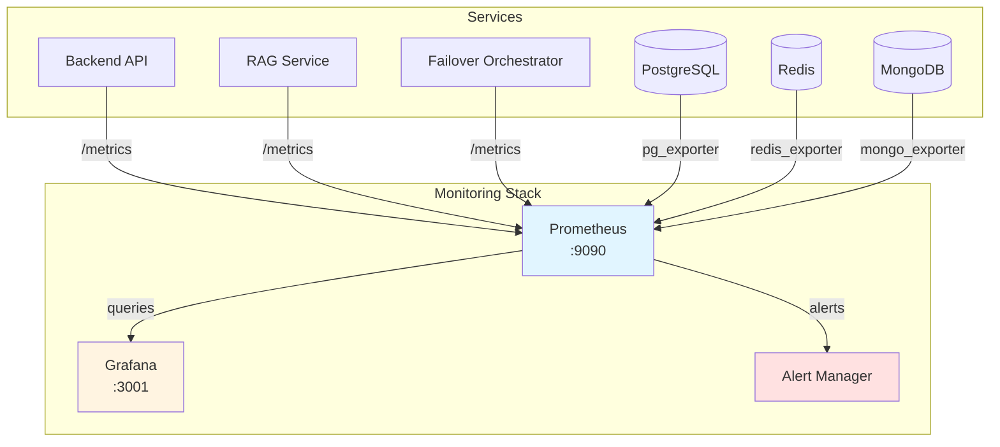

# Monitoring & Observability Guide

Comprehensive monitoring, metrics, and observability for the Tier-0 Enterprise SRE System.

---

## 📊 Monitoring Architecture



---

## 🎯 Key Metrics

### Tier-0 Availability Metrics

| Metric | Target | Alert Threshold | Description |
|--------|--------|-----------------|-------------|
| **Availability** | 99.99999% | <99.999% | System uptime (3s/year max downtime) |
| **Failover Time** | <5 seconds | >5 seconds | Multi-region failover duration |
| **API Latency (p99)** | <500ms | >1000ms | 99th percentile response time |
| **Error Rate** | <0.1% | >1% | HTTP 5xx error rate |
| **Cache Hit Rate** | >80% | <60% | Redis cache effectiveness |
| **Replication Lag** | <1 second | >5 seconds | PostgreSQL replica lag |

---

## 🔥 Prometheus Setup

### Access Prometheus

**URL**: http://localhost:9090

**Key Endpoints**:
- `/graph` - Query UI
- `/targets` - Scrape targets status
- `/alerts` - Active alerts
- `/config` - Configuration

### Scrape Configuration

**Location**: `config/prometheus/prometheus.yml`

```yaml
global:
  scrape_interval: 15s
  evaluation_interval: 15s

scrape_configs:
  # Backend API
  - job_name: 'backend'
    static_configs:
      - targets: ['backend:8000']
    metrics_path: '/metrics'

  # RAG Service
  - job_name: 'rag-service'
    static_configs:
      - targets: ['rag-service:8001']
    metrics_path: '/metrics'

  # Failover Orchestrator
  - job_name: 'failover-orchestrator'
    static_configs:
      - targets: ['failover-orchestrator:8003']
    metrics_path: '/metrics'

  # PostgreSQL
  - job_name: 'postgres'
    static_configs:
      - targets: ['postgres-exporter:9187']

  # Redis
  - job_name: 'redis'
    static_configs:
      - targets: ['redis-exporter:9121']

  # Node Exporter (system metrics)
  - job_name: 'node'
    static_configs:
      - targets: ['node-exporter:9100']
```

### Useful Prometheus Queries

**API Request Rate**:
```promql
rate(http_requests_total[5m])
```

**Error Rate**:
```promql
rate(http_requests_total{status=~"5.."}[5m]) / rate(http_requests_total[5m])
```

**API Latency (p99)**:
```promql
histogram_quantile(0.99, rate(http_request_duration_seconds_bucket[5m]))
```

**Cache Hit Rate**:
```promql
rate(redis_keyspace_hits_total[5m]) / (rate(redis_keyspace_hits_total[5m]) + rate(redis_keyspace_misses_total[5m]))
```

**Database Connections**:
```promql
pg_stat_activity_count
```

**Replication Lag**:
```promql
pg_replication_lag_seconds
```

**Failover Duration**:
```promql
failover_duration_seconds
```

**MQTT Message Rate**:
```promql
rate(mqtt_messages_received_total[5m])
```

**RabbitMQ Queue Depth**:
```promql
rabbitmq_queue_messages{queue="user_activity_queue"}
```

---

## 📈 Grafana Dashboards

### Access Grafana

**URL**: http://localhost:3001

**Default Credentials**:
- Username: `admin`
- Password: `tier0admin`

### Pre-Built Dashboards

#### 1. System Overview Dashboard

**Metrics**:
- Total request rate (requests/sec)
- Error rate (%)
- API latency (p50, p95, p99)
- Active users
- Device telemetry rate
- Cache hit rate

**Panels**:
```
┌─────────────────────────┬─────────────────────────┐
│ Request Rate            │ Error Rate              │
│ (Time Series)           │ (Time Series)           │
├─────────────────────────┼─────────────────────────┤
│ API Latency Percentiles │ Active User Sessions    │
│ (Time Series)           │ (Gauge)                 │
├─────────────────────────┼─────────────────────────┤
│ Cache Hit Rate          │ Database Connections    │
│ (Gauge)                 │ (Gauge)                 │
└─────────────────────────┴─────────────────────────┘
```

#### 2. Database Health Dashboard

**Metrics**:
- PostgreSQL connections (current/max)
- Query rate (queries/sec)
- Replication lag (seconds)
- Cache hit ratio
- Slow query count

**Panels**:
```
┌─────────────────────────┬─────────────────────────┐
│ PostgreSQL Connections  │ Replication Lag         │
│ (Time Series)           │ (Time Series)           │
├─────────────────────────┼─────────────────────────┤
│ Query Rate              │ Cache Hit Ratio         │
│ (Time Series)           │ (Gauge)                 │
├─────────────────────────┴─────────────────────────┤
│ Slow Queries (>100ms)                             │
│ (Table)                                           │
└───────────────────────────────────────────────────┘
```

#### 3. Failover Status Dashboard

**Metrics**:
- Current active region
- Last failover time
- Failover history (timeline)
- Replication health
- Redis Sentinel status

**Panels**:
```
┌──────────────────────────────────────────────────┐
│ Current Active Region: Region 1                  │
│ (Stat)                                           │
├─────────────────────────┬────────────────────────┤
│ Last Failover Time: 3.4s│ Tier-0 Compliant: ✓   │
│ (Stat)                  │ (Stat)                 │
├─────────────────────────┴────────────────────────┤
│ Failover History                                 │
│ (Time Series)                                    │
├──────────────────────────────────────────────────┤
│ Replication Lag                                  │
│ (Time Series)                                    │
└──────────────────────────────────────────────────┘
```

#### 4. AI/ML Performance Dashboard

**Metrics**:
- RAG query rate
- Query latency by type (BP/images/logs)
- Cohere API success rate
- Image processing rate
- Embedding generation time

**Panels**:
```
┌─────────────────────────┬─────────────────────────┐
│ RAG Query Rate          │ Cohere Success Rate     │
│ (Time Series)           │ (Gauge)                 │
├─────────────────────────┼─────────────────────────┤
│ Query Latency by Type   │ Query Type Distribution │
│ (Time Series)           │ (Pie Chart)             │
├─────────────────────────┴─────────────────────────┤
│ Image Processing Rate                             │
│ (Time Series)                                     │
└───────────────────────────────────────────────────┘
```

### Creating Custom Dashboards

**Example: Device Telemetry Dashboard**

```json
{
  "dashboard": {
    "title": "Device Telemetry",
    "panels": [
      {
        "title": "Telemetry Message Rate",
        "targets": [
          {
            "expr": "rate(mqtt_messages_received_total[5m])",
            "legendFormat": "Messages/sec"
          }
        ],
        "type": "graph"
      },
      {
        "title": "Devices by Type",
        "targets": [
          {
            "expr": "count by (device_type) (device_telemetry_total)",
            "legendFormat": "{{device_type}}"
          }
        ],
        "type": "piechart"
      }
    ]
  }
}
```

---

## 🚨 Alerting

### Alert Configuration

**Location**: `config/prometheus/alerts.yml`

```yaml
groups:
  - name: tier0_alerts
    interval: 30s
    rules:
      # High Error Rate
      - alert: HighErrorRate
        expr: |
          rate(http_requests_total{status=~"5.."}[5m]) / rate(http_requests_total[5m]) > 0.01
        for: 5m
        labels:
          severity: critical
        annotations:
          summary: "High error rate detected"
          description: "Error rate is {{ $value | humanizePercentage }} (threshold: 1%)"

      # API Latency
      - alert: HighLatency
        expr: |
          histogram_quantile(0.99, rate(http_request_duration_seconds_bucket[5m])) > 1
        for: 10m
        labels:
          severity: warning
        annotations:
          summary: "High API latency"
          description: "P99 latency is {{ $value }}s (threshold: 1s)"

      # Low Cache Hit Rate
      - alert: LowCacheHitRate
        expr: |
          rate(redis_keyspace_hits_total[5m]) / (rate(redis_keyspace_hits_total[5m]) + rate(redis_keyspace_misses_total[5m])) < 0.6
        for: 15m
        labels:
          severity: warning
        annotations:
          summary: "Low cache hit rate"
          description: "Cache hit rate is {{ $value | humanizePercentage }} (threshold: 60%)"

      # High Replication Lag
      - alert: HighReplicationLag
        expr: pg_replication_lag_seconds > 5
        for: 5m
        labels:
          severity: critical
        annotations:
          summary: "High PostgreSQL replication lag"
          description: "Replication lag is {{ $value }}s (threshold: 5s)"

      # Service Down
      - alert: ServiceDown
        expr: up == 0
        for: 2m
        labels:
          severity: critical
        annotations:
          summary: "Service down"
          description: "{{ $labels.job }} is down"

      # Failover Duration Exceeded
      - alert: SlowFailover
        expr: failover_duration_seconds > 5
        labels:
          severity: critical
        annotations:
          summary: "Failover exceeded Tier-0 SLA"
          description: "Failover took {{ $value }}s (SLA: <5s)"

      # RabbitMQ Queue Buildup
      - alert: RabbitMQQueueBuildup
        expr: rabbitmq_queue_messages{queue="user_activity_queue"} > 1000
        for: 10m
        labels:
          severity: warning
        annotations:
          summary: "RabbitMQ queue buildup"
          description: "Queue depth is {{ $value }} messages"

      # Cohere API Failures
      - alert: CohereAPIFailures
        expr: |
          rate(cohere_api_failures_total[5m]) / rate(cohere_api_requests_total[5m]) > 0.05
        for: 5m
        labels:
          severity: warning
        annotations:
          summary: "High Cohere API failure rate"
          description: "Failure rate is {{ $value | humanizePercentage }}"
```

### Alert Notification Channels

**Slack Integration**:
```yaml
receivers:
  - name: 'slack-notifications'
    slack_configs:
      - channel: '#tier0-alerts'
        title: 'Tier-0 Alert: {{ .GroupLabels.alertname }}'
        text: '{{ .CommonAnnotations.description }}'
```

**Email Integration**:
```yaml
receivers:
  - name: 'email-notifications'
    email_configs:
      - to: 'ops-team@example.com'
        from: 'tier0-alerts@example.com'
        subject: 'Tier-0 Alert: {{ .GroupLabels.alertname }}'
```

**PagerDuty Integration**:
```yaml
receivers:
  - name: 'pagerduty-critical'
    pagerduty_configs:
      - service_key: '<pagerduty-service-key>'
        severity: '{{ .GroupLabels.severity }}'
```

---

## 📝 Structured Logging

### Log Levels

| Level | Usage | Example |
|-------|-------|---------|
| **DEBUG** | Detailed diagnostic info | `DEBUG: Connecting to database` |
| **INFO** | General informational | `INFO: Service started on port 8000` |
| **WARNING** | Warning messages | `WARNING: Cache miss, querying database` |
| **ERROR** | Error messages | `ERROR: Database connection failed` |
| **CRITICAL** | Critical failures | `CRITICAL: Failover failed` |

### Log Format

**JSON Structured Logs**:
```json
{
  "timestamp": "2025-11-16T12:30:45.123456Z",
  "level": "INFO",
  "service": "backend",
  "message": "API request",
  "context": {
    "method": "GET",
    "endpoint": "/api/devices",
    "status_code": 200,
    "duration_ms": 45,
    "user_agent": "curl/7.79.1"
  }
}
```

### Viewing Logs

**All Services**:
```bash
docker-compose logs -f
```

**Specific Service**:
```bash
docker-compose logs -f backend
docker-compose logs -f rag-service
docker-compose logs -f failover-orchestrator
```

**Filter by Level**:
```bash
docker-compose logs | grep ERROR
docker-compose logs | grep WARNING
```

**Tail Recent Logs**:
```bash
docker-compose logs --tail=100 backend
```

**Since Timestamp**:
```bash
docker-compose logs --since 2025-11-16T12:00:00 backend
```

### Log Aggregation

**Recommended Tools**:
- **Loki** - Grafana's log aggregation system
- **ELK Stack** - Elasticsearch, Logstash, Kibana
- **Splunk** - Enterprise log management
- **CloudWatch Logs** - AWS managed service

---

## 🔍 Tracing (Future Enhancement)

### Distributed Tracing with Jaeger

**Architecture**:
```
[Backend API] → [Jaeger Agent] → [Jaeger Collector] → [Jaeger UI]
     ↓
[RAG Service] → [Jaeger Agent] → [Jaeger Collector]
     ↓
[Cohere API]
```

**Example Trace**:
```
Span 1: GET /api/query (total: 1.5s)
  ├─ Span 2: RAG Service query (1.2s)
  │  ├─ Span 3: Keyword search (0.1s)
  │  ├─ Span 4: Cohere API call (1.0s)
  │  └─ Span 5: Result formatting (0.1s)
  └─ Span 6: Response serialization (0.3s)
```

---

## 📊 Custom Metrics

### Adding Custom Metrics to Backend

**Example: Track Query Types**:

```python
from prometheus_client import Counter, Histogram

# Counter for query types
query_counter = Counter(
    'rag_queries_total',
    'Total RAG queries by type',
    ['query_type']
)

# Histogram for query latency
query_latency = Histogram(
    'rag_query_duration_seconds',
    'RAG query duration',
    ['query_type']
)

# Usage
@app.post("/api/query")
async def query(request: QueryRequest):
    start_time = time.time()

    # ... process query ...

    query_counter.labels(query_type=result['type']).inc()
    query_latency.labels(query_type=result['type']).observe(time.time() - start_time)

    return result
```

### Exposing Metrics Endpoint

```python
from prometheus_client import make_asgi_app

# Mount Prometheus metrics endpoint
metrics_app = make_asgi_app()
app.mount("/metrics", metrics_app)
```

---

## 🎯 SLA Monitoring

### 99.99999% Availability Tracking

**Formula**:
```
Availability = (Total Time - Downtime) / Total Time × 100%
```

**Tier-0 Target**:
- 99.99999% = 3.15 seconds downtime per year
- Monthly budget: 0.26 seconds
- Weekly budget: 0.06 seconds
- Daily budget: 0.0086 seconds

**Prometheus Query**:
```promql
# Uptime percentage over 30 days
avg_over_time(up[30d]) * 100
```

### Error Budget Tracking

**Error Budget Formula**:
```
Error Budget = (1 - SLA) × Total Requests
```

**Example**:
- SLA: 99.99999%
- Total Requests: 1,000,000
- Error Budget: 10 requests

**Prometheus Query**:
```promql
# Error budget consumption
sum(http_requests_total{status=~"5.."}) / sum(http_requests_total) * 100
```

---

## 🛠️ Monitoring Best Practices

### 1. The Four Golden Signals

**Latency**: Time to service requests
```promql
histogram_quantile(0.99, rate(http_request_duration_seconds_bucket[5m]))
```

**Traffic**: Request rate
```promql
rate(http_requests_total[5m])
```

**Errors**: Error rate
```promql
rate(http_requests_total{status=~"5.."}[5m]) / rate(http_requests_total[5m])
```

**Saturation**: Resource utilization
```promql
container_memory_usage_bytes / container_spec_memory_limit_bytes
```

### 2. USE Method (Resources)

**Utilization**: % time resource is busy
```promql
rate(container_cpu_usage_seconds_total[5m])
```

**Saturation**: Queue depth or waiting
```promql
rabbitmq_queue_messages
```

**Errors**: Error events
```promql
sum(rate(http_requests_total{status=~"5.."}[5m]))
```

### 3. RED Method (Services)

**Rate**: Requests per second
```promql
rate(http_requests_total[5m])
```

**Errors**: Failed requests per second
```promql
rate(http_requests_total{status=~"5.."}[5m])
```

**Duration**: Request latency
```promql
histogram_quantile(0.99, rate(http_request_duration_seconds_bucket[5m]))
```

---

## 🧪 Monitoring Validation

### Health Check Script

```bash
#!/bin/bash
# monitor-health.sh - Validate monitoring stack

echo "=== Monitoring Stack Health Check ==="

# Prometheus
echo -n "Prometheus: "
curl -s http://localhost:9090/-/healthy | grep -q "Prometheus is Healthy" && \
  echo "✓ OK" || echo "✗ FAIL"

# Grafana
echo -n "Grafana: "
curl -s http://localhost:3001/api/health | grep -q "ok" && \
  echo "✓ OK" || echo "✗ FAIL"

# Check scrape targets
echo -e "\nPrometheus Targets:"
curl -s http://localhost:9090/api/v1/targets | \
  jq -r '.data.activeTargets[] | "\(.labels.job): \(.health)"'

# Check active alerts
echo -e "\nActive Alerts:"
ALERTS=$(curl -s http://localhost:9090/api/v1/alerts | jq -r '.data.alerts | length')
echo "Active alerts: $ALERTS"

if [ "$ALERTS" -gt 0 ]; then
  curl -s http://localhost:9090/api/v1/alerts | \
    jq -r '.data.alerts[] | "\(.labels.alertname): \(.annotations.summary)"'
fi

echo "=== Health Check Complete ==="
```

---

## 📚 Related Documentation

- [Architecture](architecture.md) - System components
- [Testing Guide](testing.md) - Performance testing
- [Troubleshooting](troubleshooting.md) - Common monitoring issues
- [API Reference](api-reference.md) - Metrics endpoints

---

## 🔗 External Resources

- [Prometheus Documentation](https://prometheus.io/docs/)
- [Grafana Documentation](https://grafana.com/docs/)
- [Google SRE Book - Monitoring](https://sre.google/sre-book/monitoring-distributed-systems/)
- [Prometheus Best Practices](https://prometheus.io/docs/practices/naming/)

---

**Dashboard Access**: http://localhost:3001 (admin/tier0admin)
