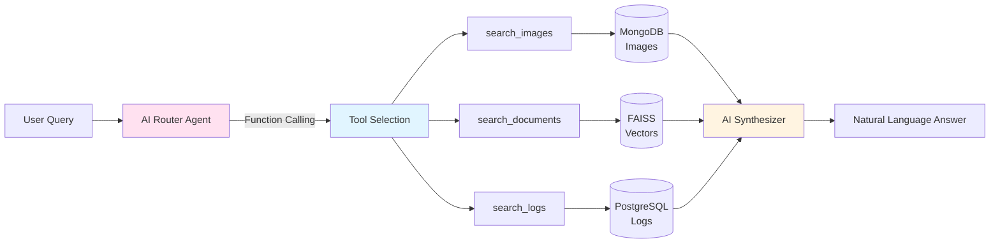
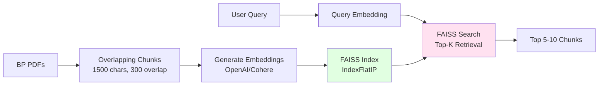

# RAG Service Architecture

## Overview

The RAG (Retrieval-Augmented Generation) Service implements an **AI-driven agentic architecture** that intelligently routes queries to appropriate data sources, retrieves relevant context, and synthesizes natural language answers. This service demonstrates modern AI agent patterns with tool use, function calling, and graceful degradation for Tier-0 reliability.

---

## Architectural Pattern: Tool-Using AI Agent

### Agent Classification

The RAG service implements a **ReAct (Reasoning + Acting) Agent** with **Tool Use**:

- **Agent Type**: Tool-using autonomous agent with function calling
- **Design Pattern**: Router + Tool Executor + Synthesizer
- **AI Capabilities**:
  - Query understanding and intent classification
  - Multi-tool selection and orchestration
  - Context retrieval from multiple data stores
  - Answer synthesis with citations

### Core AI Agent Capabilities



---

## Three-Tier AI Provider Strategy

### Tier 1: OpenAI GPT-4o (Primary)

**Provider**: OpenAI
**Models**:
- **Routing**: `gpt-4o` with function calling
- **Embeddings**: `text-embedding-3-large` (3072 dimensions)
- **Synthesis**: `gpt-4o` for answer generation

**Advantages**:
- Highest accuracy function calling (~95%)
- Superior reasoning for complex queries
- 128K context window
- Fast inference (<500ms typical)
- High-quality embeddings with better semantic understanding

**Configuration**:
```python
# Function calling for routing
response = openai_client.chat.completions.create(
    model="gpt-4o",
    messages=[...],
    tools=[
        {"type": "function", "function": {
            "name": "search_images",
            "description": "Search site camera images...",
            ...
        }},
        ...
    ],
    tool_choice="auto",
    temperature=0.1  # Low temperature for deterministic routing
)

# Embeddings for vector search
embedding_response = openai_client.embeddings.create(
    model="text-embedding-3-large",
    input=text
)

# Answer synthesis
synthesis_response = openai_client.chat.completions.create(
    model="gpt-4o",
    messages=[
        {"role": "system", "content": "You are a helpful assistant..."},
        {"role": "user", "content": prompt_with_context}
    ],
    temperature=0.3,  # Slightly higher for natural answers
    max_tokens=500
)
```

**Use Cases**:
- Multi-source query routing (e.g., "Compare BP reports to camera footage")
- Complex intent classification
- Nuanced answer synthesis requiring deep reasoning

---

### Tier 2: Cohere (Fallback)

**Provider**: Cohere
**Models**:
- **Routing**: `command-a-vision-07-2025` with tool use
- **Embeddings**: `embed-english-v3.0` (1024 dimensions)
- **Synthesis**: `command-a-vision-07-2025` for answer generation

**Advantages**:
- Good tool use accuracy (~90%)
- Cost-effective alternative
- Strong embedding quality
- Specialized for RAG workloads

**Configuration**:
```python
# Tool use for routing
response = cohere_client.chat(
    message=question,
    model="command-a-vision-07-2025",
    tools=[
        {
            "name": "search_images",
            "description": "Search site camera images...",
            "parameter_definitions": {
                "question": {"type": "str", "required": True}
            }
        },
        ...
    ],
    temperature=0.1
)

# Embeddings for vector search (with rate limiting)
embedding_response = cohere_client.embed(
    texts=[text],
    model="embed-english-v3.0",
    input_type="search_document"  # or "search_query"
)
time.sleep(0.7)  # Rate limiting: ~85 calls/min for trial keys

# Answer synthesis
synthesis_response = cohere_client.chat(
    message=prompt_with_context,
    model="command-a-vision-07-2025",
    temperature=0.3,
    max_tokens=500
)
```

**Use Cases**:
- OpenAI API unavailable or rate-limited
- Budget-constrained deployments
- Single-source queries (images, documents, or logs)

---

### Tier 3: Keyword Fallback (Tier-0 Reliability)

**Provider**: Rule-based Python logic
**Capabilities**:
- Pattern matching on query keywords
- Heuristic routing based on keyword presence
- Direct data source queries without AI

**Advantages**:
- **Zero external dependencies**
- 100% availability (no API calls)
- Predictable performance
- Suitable for Tier-0 SLA (99.99999%)

**Configuration**:
```python
# Keyword-based routing
question_lower = question.lower()

if any(kw in question_lower for kw in ["incident", "safety", "hard hat"]):
    # Route to safety analysis (BP docs + images)
    result = query_bp_documents(question) + query_images(question)

elif any(kw in question_lower for kw in ["image", "camera", "worker"]):
    # Route to MongoDB images
    result = query_images(question)

elif any(kw in question_lower for kw in ["log", "ip", "error"]):
    # Route to PostgreSQL logs
    result = query_logs(question)

elif any(kw in question_lower for kw in ["bp", "drill", "annual report"]):
    # Route to FAISS documents
    result = query_bp_documents(question)
```

**Use Cases**:
- AI providers down or degraded
- Network connectivity issues
- Cost optimization (avoid API charges)
- Testing and development environments

---

## AI Agent Workflow

### Phase 1: Query Analysis & Intent Classification

```python
def intelligent_route_query(self, question: str) -> Dict:
    """
    Uses AI function calling (OpenAI) or tool use (Cohere) to analyze
    user intent and select appropriate tools.

    Agent Reasoning Process:
    1. Parse user question for entities and intent
    2. Determine which data source(s) contain relevant information
    3. Generate tool calls with appropriate parameters
    4. Execute tools in parallel or sequence as needed
    """

    # Define available tools with rich descriptions
    tools = [
        {
            "name": "search_images",
            "description": "Search site camera images for safety compliance. "
                          "Use for: workers, PPE, hard hats, vests, tablets."
        },
        {
            "name": "search_documents",
            "description": "Search BP Annual Reports via vector search. "
                          "Use for: BP operations, Tier 1/2 events, oil spills."
        },
        {
            "name": "search_logs",
            "description": "Search system logs in PostgreSQL. "
                          "Use for: IP addresses, errors, request statistics."
        }
    ]

    # OpenAI function calling (preferred)
    if self.use_openai:
        response = self.openai_client.chat.completions.create(
            model="gpt-4o",
            messages=[
                {"role": "system", "content": "You are an intelligent query router..."},
                {"role": "user", "content": question}
            ],
            tools=tools,
            tool_choice="auto",  # Let AI decide which tools to call
            temperature=0.1
        )

        # AI returns tool_calls in response
        if response.choices[0].message.tool_calls:
            # Execute each tool the AI selected
            for tool_call in response.choices[0].message.tool_calls:
                execute_tool(tool_call.function.name, tool_call.function.arguments)
```

**Agent Reasoning Examples**:

| User Query | AI Analysis | Tools Selected |
|------------|-------------|----------------|
| "Show engineers with hard hats" | Intent: Safety compliance<br/>Entities: engineers, hard hats<br/>Source: Visual data | `search_images` |
| "BP Tier 1 incidents in 2024" | Intent: Company statistics<br/>Entities: BP, Tier 1, 2024<br/>Source: Annual reports | `search_documents` |
| "Compare BP reports to camera footage" | Intent: Cross-source analysis<br/>Entities: BP reports, cameras<br/>Source: **Multiple** | `search_documents`<br/>+<br/>`search_images` |
| "Which IPs have the most errors?" | Intent: Operations analysis<br/>Entities: IP addresses, errors<br/>Source: System logs | `search_logs` |

---

### Phase 2: Tool Execution & Context Retrieval

Each tool implements specialized retrieval logic:

#### Tool 1: `search_images` (MongoDB Query)

**Data Source**: MongoDB `tier0_images.images` collection
**Retrieval Method**: NoSQL query with safety compliance filters

```python
def query_images(self, question: str) -> Dict:
    # Extract intent from question
    looking_for_hard_hat = "hard hat" in question.lower()
    without = "without" in question.lower()

    # Build MongoDB query
    query = {"processed": True}
    if looking_for_hard_hat:
        query["safety_compliance.has_hard_hat"] = not without

    # Retrieve matching images
    results = mongodb_collection.find(query).limit(20)

    # Calculate compliance statistics
    avg_compliance = average([img["safety_compliance"]["compliance_score"]
                             for img in results])

    # Use AI to synthesize analysis (if available)
    if self.openai_client:
        context = build_image_context(results)
        answer = synthesize_answer(context, question)
        return {
            "answer": answer,
            "data": results,
            "avg_compliance": avg_compliance,
            "synthesized": True
        }
```

**Performance**: <100ms (MongoDB indexed query)

---

#### Tool 2: `search_documents` (FAISS Vector Search)

**Data Source**: BP Annual Reports (PDFs)
**Retrieval Method**: Hybrid RAG with vector + keyword + pattern matching

```python
def query_bp_documents(self, question: str) -> Dict:
    all_results = []

    # Method 1: Vector semantic search (PRIMARY)
    if self.faiss_index:
        # Generate query embedding
        query_embedding = generate_embedding(question)  # OpenAI or Cohere

        # FAISS similarity search
        distances, indices = self.faiss_index.search(query_embedding, top_k=10)

        for idx, distance in zip(indices[0], distances[0]):
            chunk = self.bp_chunks[idx]
            chunk["similarity_score"] = float(distance)
            chunk["match_type"] = "vector"
            all_results.append(chunk)

    # Method 2: Pattern-based search (for specific metrics)
    # Example: "38 Tier 1 and Tier 2 events"
    pattern = r'(\d+)\s+Tier\s+[12]\s+(?:and|&)\s+Tier\s+[12]'
    for doc in self.bp_documents.values():
        matches = re.finditer(pattern, doc["text"])
        for match in matches:
            context = extract_context(match, window=1000)
            all_results.append({
                "text": context,
                "source": doc["filename"],
                "match_type": "pattern",
                "relevance": 20  # High score for pattern matches
            })

    # Method 3: Keyword search (fallback if no vector search)
    if not vector_results:
        keywords = ["safety", "incident", "tier 1", "tier 2", "spill"]
        for doc in self.bp_documents.values():
            chunks = create_overlapping_chunks(doc["text"])
            for chunk in chunks:
                relevance = sum(1 for kw in keywords if kw in chunk.lower())
                if relevance > 0:
                    all_results.append({
                        "text": chunk,
                        "source": doc["filename"],
                        "match_type": "keyword",
                        "relevance": relevance
                    })

    # Deduplicate and rank by relevance
    unique_results = deduplicate(all_results)
    unique_results.sort(key=lambda x: x["relevance"], reverse=True)

    # Use AI to synthesize answer from top snippets
    top_snippets = unique_results[:5]
    context = "\n\n---\n\n".join([s["text"] for s in top_snippets])
    answer = synthesize_answer(context, question)

    return {
        "answer": answer,
        "sources": top_snippets,
        "type": "bp_documents",
        "synthesized": True
    }
```

**Hybrid RAG Benefits**:
- **Vector search**: Semantic understanding, finds conceptually similar passages
- **Pattern matching**: Catches specific metrics even if semantically distant
- **Keyword search**: Tier-0 fallback when vector search unavailable

**Performance**: 500-2000ms (depends on vector search + LLM synthesis)

---

#### Tool 3: `search_logs` (PostgreSQL Aggregation)

**Data Source**: PostgreSQL `system_logs` table
**Retrieval Method**: SQL aggregation queries

```python
def query_logs(self, question: str) -> Dict:
    # Rule-based query classification
    if "ip" in question.lower() and "most" in question.lower():
        # SQL aggregation for top IPs
        query = """
            SELECT ip_address, COUNT(*) as request_count,
                   COUNT(*) FILTER (WHERE status_code >= 400) as error_count
            FROM system_logs
            GROUP BY ip_address
            ORDER BY request_count DESC
            LIMIT 20
        """
        results = execute_query(query)

        # Use AI to synthesize insights
        context = format_results_as_context(results)
        answer = synthesize_answer(context, question)

        return {
            "answer": answer,
            "data": results,
            "type": "log_analysis",
            "synthesized": True
        }
```

**Performance**: <50ms (PostgreSQL indexed query)

---

### Phase 3: Multi-Source Synthesis

When AI selects multiple tools, the agent combines results:

```python
# Example: "Compare BP safety reports to camera footage"
# AI selects BOTH tools: search_documents + search_images

results = []

# Execute tool 1
doc_result = query_bp_documents(question)
doc_result["tool_used"] = "search_documents"
results.append(doc_result)

# Execute tool 2
image_result = query_images(question)
image_result["tool_used"] = "search_images"
results.append(image_result)

# Synthesize combined answer
combined_context = f"""
From BP Annual Reports: {doc_result['answer']}

From Site Camera Analysis: {image_result['answer']}
"""

synthesis_prompt = f"""
User asked: "{question}"

Data from multiple sources:
{combined_context}

Synthesize a comprehensive answer comparing both sources.
"""

final_answer = synthesize_answer(synthesis_prompt, max_tokens=600)

return {
    "answer": final_answer,
    "sources": results,
    "tools_called": ["search_documents", "search_images"],
    "type": "multi_source_ai_routing",
    "synthesized": True
}
```

---

## Vector Search Architecture (FAISS)

### Embedding Pipeline



### FAISS Configuration

**Index Type**: `IndexFlatIP` (Inner Product)
- **Why**: After L2 normalization, inner product = cosine similarity
- **Advantage**: Exact search (no approximation)
- **Trade-off**: Slower than approximate methods (LSH, IVF), but acceptable for ~1000 vectors

**Embedding Normalization**:
```python
# Normalize embeddings for cosine similarity
faiss.normalize_L2(embeddings_matrix)

# Add to index
self.faiss_index.add(embeddings_matrix)
```

**Chunk Strategy**:
- **Size**: 1500 characters per chunk
- **Overlap**: 300 characters between chunks
- **Why**: Prevents cutting context mid-sentence, ensures key information appears in multiple chunks

**Caching**:
```python
# Save index to disk for fast restarts
CACHE_DIR = Path("/app/cache")
faiss.write_index(self.faiss_index, str(CACHE_DIR / "faiss_index.bin"))

# Save chunk metadata
with open(CACHE_DIR / "chunks.pkl", 'wb') as f:
    pickle.dump(self.bp_chunks, f)
```

### Search Process

```python
def vector_search(self, question: str, top_k: int = 5) -> List[Dict]:
    # 1. Generate query embedding
    query_embedding = generate_embedding(question)  # 3072-dim or 1024-dim
    query_embedding = query_embedding.reshape(1, -1)

    # 2. Normalize for cosine similarity
    faiss.normalize_L2(query_embedding)

    # 3. Search FAISS index
    distances, indices = self.faiss_index.search(query_embedding, top_k)

    # 4. Retrieve matching chunks with metadata
    results = []
    for idx, distance in zip(indices[0], distances[0]):
        chunk = self.bp_chunks[idx]
        chunk["similarity_score"] = float(distance)  # Cosine similarity (0-1)
        results.append(chunk)

    return results
```

**Similarity Score Interpretation**:
- **0.9-1.0**: Highly relevant (near-duplicate semantics)
- **0.7-0.9**: Relevant (same topic, different wording)
- **0.5-0.7**: Moderately relevant (related concepts)
- **<0.5**: Low relevance (different topic)

---

## Performance & Scalability

### Latency Breakdown

| Component | Latency | Notes |
|-----------|---------|-------|
| **AI Routing** (OpenAI gpt-4o) | 200-500ms | Function calling |
| **AI Routing** (Cohere) | 300-600ms | Tool use |
| **Keyword Routing** | <1ms | Rule-based |
| **Vector Search** (FAISS) | 5-20ms | Depends on index size |
| **MongoDB Query** | 10-50ms | Indexed query |
| **PostgreSQL Query** | 10-100ms | Aggregation complexity |
| **Embedding Generation** (OpenAI) | 100-200ms | text-embedding-3-large |
| **Embedding Generation** (Cohere) | 200-500ms | embed-english-v3.0 |
| **Answer Synthesis** (OpenAI) | 300-1000ms | gpt-4o generation |
| **Answer Synthesis** (Cohere) | 400-1200ms | command-a-vision |
| **Total (Single Source)** | 500-2000ms | End-to-end |
| **Total (Multi-Source)** | 1000-3000ms | Parallel tool execution |

### Rate Limiting

**OpenAI** (Paid Tier):
- **Embeddings**: ~3000 RPM (no sleep needed)
- **Chat**: ~500 RPM (no sleep needed)

**Cohere** (Trial Key):
- **Embeddings**: 100 calls/min → sleep 0.7s between calls
- **Chat**: 100 calls/min → sleep 0.7s between calls

**Mitigation**:
- Cache embeddings on disk (build once, load fast on restart)
- Batch embedding generation during initialization
- Use OpenAI when available (higher rate limits)

### Scalability Considerations

**Vector Index Size**:
- Current: ~1000 chunks from BP PDFs
- FAISS IndexFlatIP: Linear search O(n)
- **Scale Limit**: ~10K chunks before needing approximate search
- **Solution for Scale**: Switch to IndexIVFFlat (inverted file index) for >10K chunks

**Memory Usage**:
- OpenAI embeddings: 3072 dim × 1000 chunks × 4 bytes = ~12 MB
- Cohere embeddings: 1024 dim × 1000 chunks × 4 bytes = ~4 MB
- FAISS index overhead: ~2x embedding size
- **Total**: ~24 MB (OpenAI) or ~8 MB (Cohere)

**Horizontal Scaling**:
- RAG service is **stateless** after initialization
- Can deploy multiple replicas behind load balancer
- Share FAISS cache via distributed file system (NFS, S3)

---

## Reliability & Graceful Degradation

### Tier-0 Reliability Strategy

```python
def process_query(question: str) -> Dict:
    # PHASE 1: Try AI-driven routing (best user experience)
    try:
        result = intelligent_route_query(question)  # OpenAI or Cohere
        if result:
            return result  # ✓ AI routing succeeded
    except Exception as e:
        logger.warning(f"AI routing failed: {e}")

    # PHASE 2: Fallback to keyword routing (Tier-0 reliability)
    logger.info("Using keyword-based routing (Tier-0 fallback)")

    if any(kw in question.lower() for kw in ["incident", "safety"]):
        # Combine BP documents + images for comprehensive answer
        return combine_safety_results(question)

    elif any(kw in question.lower() for kw in ["image", "camera"]):
        return query_images(question)

    elif any(kw in question.lower() for kw in ["log", "ip", "error"]):
        return query_logs(question)

    else:
        return clarification_message()
```

### Fallback Chain

```
┌──────────────────────────────────────────────────────┐
│ Level 1: OpenAI gpt-4o Function Calling             │
│ Accuracy: ~95% | Latency: 200-500ms                  │
└──────────────────────────────────────────────────────┘
                    ↓ (if API unavailable)
┌──────────────────────────────────────────────────────┐
│ Level 2: Cohere command-a-vision Tool Use            │
│ Accuracy: ~90% | Latency: 300-600ms                  │
└──────────────────────────────────────────────────────┘
                    ↓ (if API unavailable)
┌──────────────────────────────────────────────────────┐
│ Level 3: Keyword-Based Routing (Rule-Based)          │
│ Accuracy: ~70-80% | Latency: <1ms                    │
│ ✓ Tier-0 Reliable (No External Dependencies)         │
└──────────────────────────────────────────────────────┘
```

### Error Handling

**AI Provider Failures**:
- Network timeout
- Rate limit exceeded
- API key invalid
- Model unavailable

**Mitigation**:
```python
try:
    response = openai_client.chat.completions.create(...)
except openai.APIError as e:
    logger.error(f"OpenAI API error: {e}")
    # Try Cohere fallback
except openai.RateLimitError:
    logger.warning("OpenAI rate limit, falling back to Cohere")
    # Try Cohere fallback
except Exception as e:
    logger.error(f"Unexpected error: {e}")
    # Fall back to keyword routing
```

---

## API Endpoints

### Unified Endpoint (AI-Driven Routing)

```http
POST /query
Content-Type: application/json

{
  "question": "Compare BP reports to camera footage"
}
```

**Response**:
```json
{
  "question": "Compare BP reports to camera footage",
  "result": {
    "answer": "BP's 2024 annual report shows 38 Tier 1 and Tier 2 events... Site camera analysis reveals...",
    "tools_called": ["search_documents", "search_images"],
    "routing_method": "ai_function_calling",
    "sources": [...],
    "synthesized": true
  },
  "timestamp": "2025-11-16T12:30:00Z"
}
```

### Direct Endpoints (Bypass AI Routing)

```http
# MongoDB images
POST /query/images
{"question": "Workers without hard hats"}

# FAISS BP documents
POST /query/documents
{"question": "BP Tier 1 incidents in 2024"}

# PostgreSQL logs
POST /query/logs
{"question": "Top IP addresses by traffic"}
```

### Stats Endpoint

```http
GET /stats
```

**Response**:
```json
{
  "bp_documents_loaded": 2,
  "log_entries_cached": 10000,
  "openai_enabled": true,
  "cohere_enabled": true,
  "ai_provider": "OpenAI",
  "vector_index_size": 987,
  "endpoints": {
    "unified": "/query (AI-driven routing)",
    "images": "/query/images (MongoDB)",
    "documents": "/query/documents (FAISS)",
    "logs": "/query/logs (PostgreSQL)"
  }
}
```

---

## Configuration

### Environment Variables

```bash
# AI Provider Selection (Tier 1 preferred, Tier 2 fallback)
OPENAI_API_KEY=sk-...              # Preferred for routing + embeddings
COHERE_API_KEY=your_key_here       # Fallback provider

# Database Connections
POSTGRES_HOST=postgres
POSTGRES_DB=tier0_db
POSTGRES_USER=tier0user
POSTGRES_PASSWORD=tier0pass
MONGODB_HOST=mongodb
MONGODB_USER=tier0admin
MONGODB_PASSWORD=tier0mongo

# Data Paths
LOG_DIR=/app/logs                  # System logs
BP_DOCS_DIR=/app/bp_docs          # BP PDFs
CACHE_DIR=/app/cache              # FAISS index cache
```

### Docker Compose Configuration

```yaml
rag-service:
  build: ./services/rag-service
  environment:
    - OPENAI_API_KEY=${OPENAI_API_KEY}      # Set in .env file
    - COHERE_API_KEY=${COHERE_API_KEY}      # Set in .env file
    - POSTGRES_HOST=postgres
    - MONGODB_HOST=mongodb
  volumes:
    - ./assignment-materials/LogData:/app/logs
    - ./assignment-materials/BP_10K:/app/bp_docs
    - rag-cache:/app/cache  # Persist embeddings
  ports:
    - "8001:8001"
```

---

## Common AI Agent Architectures Comparison

| Pattern | Description | Example | Used in RAG Service? |
|---------|-------------|---------|---------------------|
| **ReAct** | Reasoning + Acting with tool use | Agent reasons about query → selects tools → executes → synthesizes | ✅ **Yes** (core pattern) |
| **Chain-of-Thought** | Multi-step reasoning with intermediate thoughts | "Let me think step by step: 1) ... 2) ... 3) ..." | ✅ Yes (implicit in AI routing) |
| **Function Calling** | LLM outputs structured function calls | `{"name": "search_images", "args": {...}}` | ✅ Yes (OpenAI gpt-4o) |
| **Tool Use** | Similar to function calling (Cohere terminology) | `ToolCall(name="search_images", parameters={...})` | ✅ Yes (Cohere fallback) |
| **RAG** (Base Pattern) | Retrieval-Augmented Generation | Retrieve docs → pass to LLM → generate answer | ✅ Yes (all queries) |
| **Hybrid RAG** | Multiple retrieval methods combined | Vector + keyword + pattern matching | ✅ Yes (document search) |
| **Multi-Agent** | Multiple specialized agents collaborate | Agent 1: Router, Agent 2: Retriever, Agent 3: Synthesizer | ⚠️ Partial (single agent with multiple tools) |
| **Agentic Workflow** | Agent autonomously decides next actions | "What should I do next? Should I call more tools?" | ⚠️ Partial (limited to tool selection) |
| **Self-Correction** | Agent reviews and corrects its output | "Is my answer accurate? Let me verify..." | ❌ No (future enhancement) |
| **Plan-and-Execute** | Agent creates plan before execution | "Step 1: Search docs, Step 2: Search images, Step 3: Compare" | ❌ No (tools called in parallel) |

### RAG Service Pattern Summary

**Primary Pattern**: **ReAct Agent with Tool Use**

**Architecture Classification**:
- ✅ Autonomous tool selection (AI decides which tools to call)
- ✅ Multi-tool orchestration (can call multiple tools per query)
- ✅ Context retrieval from heterogeneous sources (MongoDB, FAISS, PostgreSQL)
- ✅ Answer synthesis with citations
- ✅ Graceful degradation (3-tier fallback strategy)
- ⚠️ Limited self-correction (no output review loop)
- ⚠️ Limited planning (executes tools immediately, no multi-step planning)

---

## Future Enhancements

### Potential Improvements

1. **Self-Correction Loop**
   - After generating answer, agent reviews for accuracy
   - If uncertain, calls additional tools for verification

2. **Plan-and-Execute**
   - For complex queries, generate step-by-step plan before execution
   - Example: "Compare 2023 vs 2024 BP reports" → Plan: [Search 2023 docs, Search 2024 docs, Compare metrics]

3. **Streaming Responses**
   - Stream tokens as they're generated (SSE or WebSocket)
   - Better UX for long answers

4. **Semantic Caching**
   - Cache similar queries by embedding similarity
   - If new query is 95% similar to cached query, return cached result

5. **Multi-Agent Collaboration**
   - Separate agents: Router Agent, Retriever Agent, Synthesizer Agent
   - Each agent specialized and fine-tuned for its task

6. **Active Learning**
   - Track user feedback (thumbs up/down)
   - Fine-tune routing decisions based on feedback

7. **Query Expansion**
   - Agent automatically expands query with synonyms
   - Example: "safety incidents" → "safety incidents OR process safety events OR Tier 1 events"

---

## Related Documentation

- [Data Pipelines](data-pipelines.md) - RAG query pipeline flow
- [System Architecture](architecture.md) - Overall system design
- [API Reference](api-reference.md) - Endpoint specifications
- [Development Guide](development.md) - Local testing

---

**Document Version**: 1.0
**Last Updated**: November 2025
**Author**: Tier-0 SRE Team
